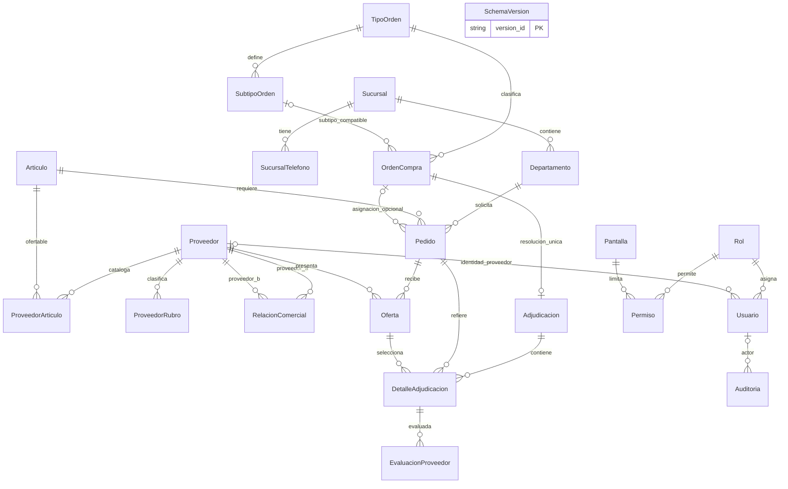

# Base de datos: diseño, relaciones e integridad

Complemento de capítulos 8 y 9 de la [guía](GUIA_COMPLETA_DESARROLLO.md). Los diccionarios [SQL Server](DICCIONARIO_SQLSERVER.md) y [PostgreSQL](DICCIONARIO_POSTGRES.md) contienen todas las columnas, tipos, tamaños, nulabilidad, PK, FK e índices. Aquí se explica por qué existe cada relación y cómo se refuerza el modelo.

## Evolución incremental

El DDL inicial contiene 18 tablas y dos triggers por motor. V001 agrega SucursalTelefono, ProveedorRubro y Auditoria; el ejecutor crea SchemaVersion. El resultado final es 22 tablas. V002 protege historial y compatibilidad tipo/subtipo; V003 añade observaciones; V004 corrige el periodo de órdenes abiertas. No se recrearon tablas para esas ampliaciones.

| Etapa | Modificación | Aprendizaje |
|---|---|---|
| DDL base | PK, FK, UNIQUE, CHECK y fechas básicas | Diseñar identidad y relaciones antes de formularios |
| V001 | Teléfonos, rubros, estados, auditoría, cuatro índices, vista y tres triggers | Valores múltiples se separan; correspondencias entre filas requieren reglas adicionales |
| V002 | Unicidad de subtipo, FK compuesta, par canónico y cinco triggers | Cambios de padres y ganadores también pueden invalidar historial |
| V003 | Observaciones nullable varchar 300 | Ampliar el modelo conservando datos |
| V004 | Vista exige creación<=hoy<=límite y falta de resolución | Distinguir programada de abierta |

MigrarBases ejecuta las versiones explícitamente, no al arrancar HTTP. Confirma una transacción por versión y por motor. SchemaVersion evita repetir versiones, pero no compara checksums ni coordina rollback distribuido. Un cambio futuro debe tener versión nueva.

## Tablas y propósito

| Tabla | Identidad/claves destacadas | Función |
|---|---|---|
| Adjudicacion | Consultar diccionario de columnas | Resolución; id_orden único |
| Articulo | Consultar diccionario de columnas | Unidad de compra; código único; estado |
| Auditoria | Consultar diccionario de columnas | Actor opcional, acción, entidad, referencia y fecha |
| Departamento | Consultar diccionario de columnas | Unidad solicitante; sucursal/nombre único |
| DetalleAdjudicacion | Consultar diccionario de columnas | Oferta escogida, cantidad y precio; único adjudicación/pedido |
| EvaluacionProveedor | Consultar diccionario de columnas | Calificación 1–5 de un detalle adjudicado |
| Oferta | Consultar diccionario de columnas | Proveedor,pedido,fecha y precio ofrecido; puede haber más de una |
| OrdenCompra | Consultar diccionario de columnas | Agrupa necesidades y periodo de ofertas |
| Pantalla | Consultar diccionario de columnas | Nombre de módulo autorizable único |
| Pedido | Consultar diccionario de columnas | Necesidad de artículo/cantidad/fechas por departamento; orden opcional |
| Permiso | Consultar diccionario de columnas | PK rol/pantalla; cuatro booleanos CRUD |
| Proveedor | Consultar diccionario de columnas | Ofertante; código único; contacto y rubro principal |
| ProveedorArticulo | Consultar diccionario de columnas | Catálogo con precio;PK proveedor/artículo |
| ProveedorRubro | Consultar diccionario de columnas | PK proveedor/rubro para rubros adicionales |
| RelacionComercial | Consultar diccionario de columnas | Relación entre dos proveedores; par único canónico |
| Rol | Consultar diccionario de columnas | Perfil de acceso con nombre único |
| SchemaVersion | Consultar diccionario de columnas | PK version_id; control de migraciones |
| SubtipoOrden | Consultar diccionario de columnas | Normal/Urgente por tipo; FK compuesta compatible |
| Sucursal | Consultar diccionario de columnas | Sede y contacto principal; código único |
| SucursalTelefono | Consultar diccionario de columnas | PK sucursal/teléfono para teléfonos adicionales |
| TipoOrden | Consultar diccionario de columnas | Grande/Chica; nombre único |
| Usuario | Consultar diccionario de columnas | Nombre/email únicos, hash, rol y proveedor opcional |

## ER físico simplificado

Las relaciones del diagrama representan FK físicas. El detalle no tiene UNIQUE global de id_pedido o id_oferta: tiene UNIQUE(adjudicación,pedido). Que cada pedido tenga una ganadora final se refuerza con la resolución única por orden, correspondencias y servicio. El servicio exige todos los pedidos; una FK sola permitiría insertar directamente un encabezado sin detalles. La relación tipo/subtipo resume la FK compuesta que exige compatibilidad de ambos IDs.

## Sentido de cada relación

Sucursal contiene departamentos y teléfonos adicionales. Departamento origina pedidos. Articulo participa en pedidos y catálogos de proveedores. ProveedorArticulo resuelve la relación muchos-a-muchos con precio vigente; ese precio no reemplaza una oferta histórica. ProveedorRubro registra pertenencias múltiples, mientras categoria conserva el rubro principal del modelo anterior. RelacionComercial tiene dos FK al mismo proveedor y exige par distinto/canónico.

OrdenCompra agrupa pedidos cuya asignación puede ser null. TipoOrden clasifica la orden; SubtipoOrden es opcional y debe pertenecer al tipo seleccionado. Oferta pertenece a un proveedor y un pedido; el artículo y la orden se obtienen de ese pedido. Adjudicacion corresponde a una orden única y DetalleAdjudicacion vincula pedido y oferta seleccionada. EvaluacionProveedor referencia un detalle, de cuya oferta se obtiene el proveedor. Usuario referencia Rol y opcionalmente Proveedor; Permiso relaciona Rol/Pantalla. Auditoria tiene actor opcional. SchemaVersion es control de instalación, separado del negocio.

## Integridad y borrado

Los CHECK de cantidades/precios positivos y fechas dentro de una fila no bastan para comparar tablas. tr_Oferta_Integridad comprueba pedido asignado, oferta dentro del plazo y artículo en catálogo. tr_DetalleAdjudicacion_Integridad exige compatibilidad entre orden, pedido, oferta y cantidad; el servicio añade proveedor activo, precio igual al de la oferta y todos los pedidos incluidos. Los dos triggers del DDL base controlan creación/solicitud y resolución/creación.

V002 impide reasignar/cambiar el artículo de un pedido con ofertas, reducirlo por debajo de lo adjudicado, alterar una oferta ganadora, modificar resolución o plazo en contradicción con las ofertas, y quitar un catálogo con ofertas históricas. Son diez triggers de negocio definidos entre DDL base y V001/V002:2+3+5. No se encontraron procedimientos almacenados de negocio. PostgreSQL usa funciones PL/pg SQL como soporte de triggers, no una capa REST ni un motor Jasper.

No hay borrado general en cascada. Una FK puede impedir eliminar un padre referenciado y traducirse a 409 en el API operativo. El estado Inactivo permite preservar artículos/proveedores. Los servicios genéricos también protegen la cuenta propia, el último administrador y nombres de roles académicos.

## Índices y diferencias de motores

V001 agrega IX_Pedido_Orden, IX_Oferta_Pedido Proveedor, IX_Departamento_Sucursal e IX_Adjudicacion_Fecha. SQL Server incluye columnas adicionales mediante INCLUDE en tres de esos índices; PostgreSQL conserva índices simples equivalentes. PK/UNIQUE generan otros índices inventariados. No se conserva un estudio EXPLAIN/plan que mida la mejora individual.

SQL Server usa IDENTITY, BIT, TINYINT, DATETIME2, GETDATE, SYSUTCDATETIME y THROW. PostgreSQL usa GENERATED BY DEFAULT AS IDENTITY, BOOLEAN, SMALLINT, TIMESTAMP, CURRENT_DATE/CURRENT_TIMESTAMP y RAISE EXCEPTION. Los nombres PostgreSQL sin comillas se observan en minúsculas. Auditoria usa UTC explícito en SQL Server; la conversión/zona de CURRENT_TIMESTAMP depende del entorno PostgreSQL y no se certifica idéntica.

Las consultas operativas usan T-SQL y bloqueos SQL Server: cambiar un driver no convierte el backend a PostgreSQL. Ambos motores se migran/siembran/verifican explícitamente; no hay réplica automática.

## Semilla y normalización

SemillaDemo usa claves naturales, SecureRandom y fecha base privada persistida. Crea 5 sucursales,10 departamentos,50 artículos,20 proveedores,100 pedidos,20 órdenes,180 ofertas,10 adjudicaciones y 30 detalles. Cada proveedor recibe 50 artículos:1000 relaciones de catálogo. No borra extras ni cambia claves de acceso de usuarios existentes. Las fechas abiertas cambiarán al avanzar el calendario.

Los atributos dependen de sus claves: el departamento no copia dirección de sucursal, el permiso no repite nombre de rol y la evaluación obtiene proveedor desde oferta. Estados y montos se calculan; se conservan hechos históricos de oferta/resolución. [MODELO_DATOS.md](MODELO_DATOS.md) detalla dependencias funcionales y 3FN; una FK por sí sola no demuestra normalización.
