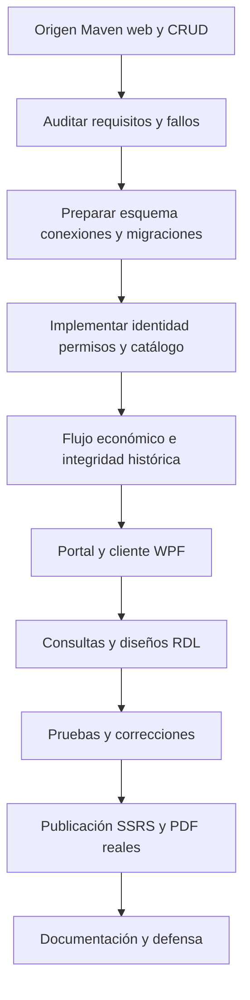

# Cronología reconstruida del desarrollo

La reconstrucción combina Git y registros fechados. Las fechas de archivos no prueban autoría ni una decisión técnica. HEAD conserva el último commit indicado; las ampliaciones posteriores aparecen como cambios locales.

| Fecha | Evidencia | Hecho que puede afirmarse |
|---|---|---|
| 10 septiembre 2026 | ec020ce, first commit | Inicio del historial con README. |
| 10 septiembre 2026 | 337f5cd, primera subida | Estructura Maven/web, Hello, web.xml y metadatos Eclipse. |
| 10 septiembre 2026 | 1c3a1e6, prueba | Sonda testconexion; su nombre no prueba una conexión exitosa. |
| 30 septiembre 2026 | f8f46f2, algunos archivos | Conexiones, login, filtro/sesión, Sucursal y utilidades iniciales. |
| 30 septiembre 2026 | 32bc959, departamento y sucursales | CRUD de Departamento y página sobre la estructura previa. |
| 30 septiembre 2026 | a61495a, Ignorar carpeta target de compilación | Retiro de artefactos generados del historial. |
| 1 octubre 2026 | e5a0b0c, Primer aporte de Jaime | DDL, artículos, proveedores, catálogo y páginas; no todos los cambios finales. |
| 5 octubre 2026 | AUDITORIA_INICIAL y sondas | 18 tablas de DDL y 30 fuentes Java; SQL conectaba a una base vacía; PostgreSQL rechazaba la conexión; seguridad parcial. |
| 5–6 octubre 2026 | Fuentes, migraciones y registros locales | Configuración externa, pools independientes, permisos/CSRF, catálogo genérico y compras transaccionales. |
| 5–6 octubre 2026 | Portal, WPF, RDL y suites | Clientes sobre la misma API, ocho informes y correcciones de integridad/fechas. |
| 6 octubre 2026, 00:29:59 | java-build.txt | Build Java de cierre; no permite fechar cada módulo individualmente. |
| 6 octubre 2026 | bases/http/wpf y PMD | Pruebas técnicas y deuda de calidad documentada. |
| 6 octubre 2026, 01:56–01:57 | ejecucion-ssrs.txt y publicacion-real.json | Publicación con identidad Windows y ocho PDF; posterior comparación de 285 filas y 20 páginas. |
| 6 octubre 2026 | Guía, inventario y validación | Documentación académica, sin cambios de lógica ni configuración. |

No se encontró evidencia suficiente en el repositorio para confirmar este punto: fecha exacta y autor de cada ampliación local. La fecha de negocio de la semilla tampoco equivale a la fecha de escritura del código.

## Orden de aprendizaje

Este diagrama organiza dependencias para estudiar. Las fases pudieron iterar; no equivale a diez commits adicionales ni a un diario completo. Ver [AUDITORIA_INICIAL.md](AUDITORIA_INICIAL.md) y [EVIDENCIA_VERIFICACION.md](EVIDENCIA_VERIFICACION.md).
