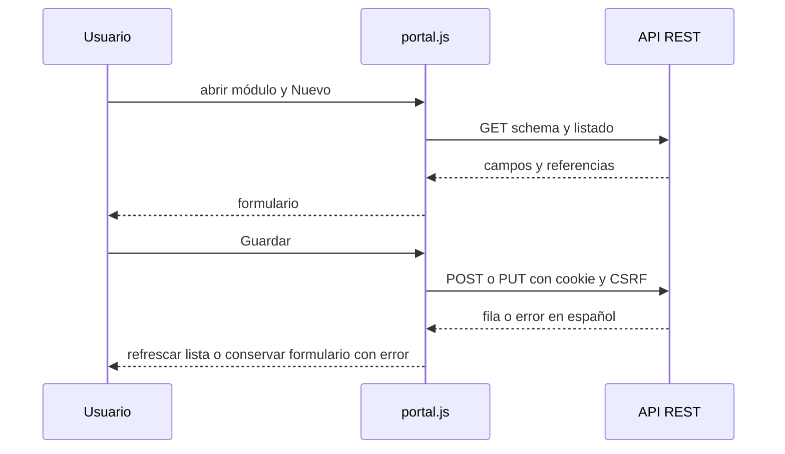

# Frontend: construcción de cada interacción

Complemento del capítulo 14. Fuentes: [portal.html](../src/main/webapp/portal.html), [portal.js](../src/main/webapp/js/portal.js), [api.js](../src/main/webapp/js/api.js) y [portal.css](../src/main/webapp/css/portal.css).

## Componentes y llamadas

| Función | Entrada | Trabajo y resultado |
|---|---|---|
| guateSession | Actualización opcional | GET login/me y promesa de identidad |
| wrapper de fetch | URL y opciones | Cookie y CSRF para API del mismo origen |
| init | Sesión | Identidad, menú permitido, logout y carga inicial |
| navigate/load | Módulo, página, búsqueda | Selección del recorrido, estado y errores; ticket descarta cargas antiguas |
| catalog | Módulo | Schema/lista en paralelo, tabla y paginación |
| editCatalog | Schema y fila opcional | Controles, referencias, POST/PUT |
| editOrder/showOrder | Orden o ID | Agrupación de pedidos y comparación |
| editAward | Orden/resolución | Una selección ganadora por pedido |
| reports | Catálogo y parámetros | Consulta, CSV, impresión y enlace SSRS |
| dashboard | Métricas JSON | Tarjetas, barras CSS y seguimiento |
| el/table/guateRow | Texto, filas y callbacks | Elementos con textContent y eventos |

## Cómo se evita duplicar formularios

Modulo declara tipos, claves, referencias y requisitos. editCatalog genera controles, carga nombres mediante all (páginas de 100) y envía los campos snake_case. En edición bloquea claves; el servidor también las protege. El proveedor recibe su ID fijado y el servidor verifica propiedad, de modo que readOnly no es la barrera de seguridad. Los permisos visibles orientan, pero el backend decide.

La búsqueda q del catálogo se aplica a campos text/email/status y reinicia página; órdenes no tiene ese mismo buscador genérico. Mensajes de error utilizan el JSON del API;401 redirige a login. El ticket de carga impide que una respuesta anterior sobrescriba un módulo recién seleccionado. No hay framework externo SPA ni biblioteca de gráficos.

## Dinero, datos y reportes

Intl.NumberFormat es-GT/GTQ muestra montos. Las barras usan CSS y el ranking de la API. El DOM usa textContent en lugar de interpretar valores como HTML. CSV incorpora BOM, comillas escapadas y neutraliza prefijos de fórmula. La impresión depende del navegador; los PDF oficiales los renderiza SSRS. El enlace SSRS traduce parámetros a mayúsculas RDL y abre navegador con autenticación independiente.

## Limitación real en observaciones de orden

editOrder muestra observaciones pero no incluye ese valor en el objeto enviado a send('ordenes',...). Backend y WPF sí lo admiten y envían. No se afirma que esa observación persista al escribirla en el portal actual. Esta tarea no cambia JavaScript. El formulario de adjudicación sí incluye observaciones.

## Páginas conservadas

Las páginas originales de sucursales/departamentos/artículos/proveedores/catálogo usan contratos específicos y api.js. web.xml tiene portal.html como bienvenida; no todas las páginas anteriores tienen campos/paginación/auditoría idénticos. node --check y revisión dirigida son evidencia de sintaxis/inspección, no un pentest exhaustivo de browser o accesibilidad.
