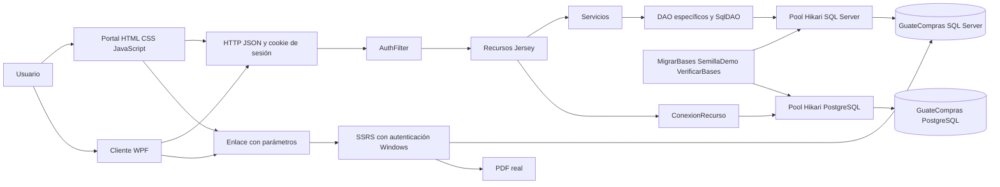
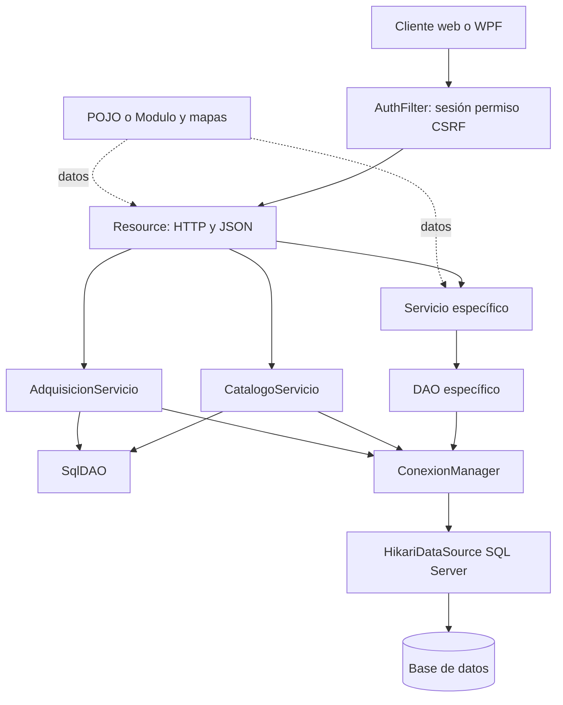
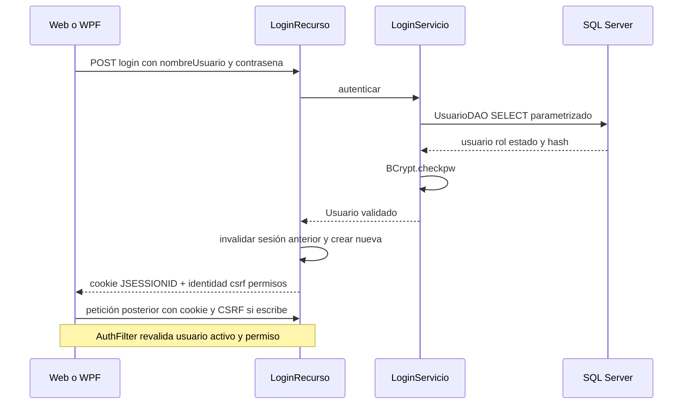
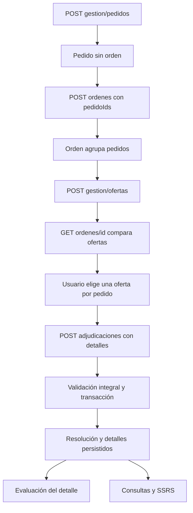
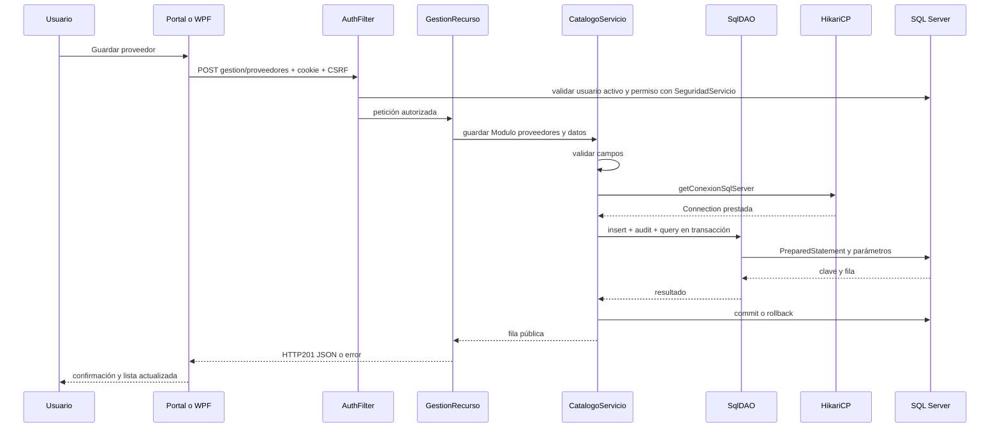

# Guía completa del desarrollo — GuateCompras

**Estado inspeccionado:6 de octubre de 2026.** Guía técnica y académica basada en código, configuración pública, esquema, historial Git y registros del repositorio. Se documenta el desarrollo desde el origen hasta el cierre local, incluida publicación real de ocho informes SSRS. Esta tarea no modifica código, tablas, endpoints, runtime ni lógica de negocio.

La historia y el diseño actual se distinguen explícitamente: un estado del árbol puede probar una implementación sin revelar la reunión, alternativa o fecha exacta en que se decidió. Cuando falta esa evidencia se indica «No se encontró evidencia suficiente en el repositorio para confirmar este punto». La explicación del motivo técnico no se presenta como recuerdo de decisiones no registradas.

## Cómo estudiar esta guía

Primera lectura: capítulos 1–6 para contexto;7–13 para servidor/datos/seguridad/compra;14–18 para interfaces/reportes;19–27 para pruebas, problemas, mantenimiento y estado;28–29 para defensa y un recorrido completo. Los documentos especializados añaden contratos, consultas y referencias; los diccionarios existentes conservan el detalle por columna.

| Documento | Profundización |
|---|---|
| [ARQUITECTURA](ARQUITECTURA.md) |Responsabilidades y 49 clases por paquete |
| [BASE_DATOS](BASE_DATOS.md) |22 tablas,ER,integridad,migraciones e índices |
| [BACKEND](BACKEND.md) |Rutas extraídas,17 módulos,contratos y transacciones |
| [FRONTEND](FRONTEND.md) |Funciones DOM/fetch,formularios y limitaciones |
| [WPF](WPF.md) |XAML,VM,HttpClient y cliente Windows |
| [REPORTES](REPORTES.md) |Cada RDL,SQL literal,parámetros y PDF verificado |
| [SEGURIDAD](SEGURIDAD.md) |Sesiones,permisos,scope,CSRF y límites |
| [PRUEBAS](PRUEBAS.md) |Entradas,resultados reales y evidencia |
| [INSTALACION](INSTALACION.md) |Reproducción desde bases vacías o equipo existente |
| [MANUAL_USUARIO](MANUAL_USUARIO.md) |Recorrido práctico por perfil |
| [FAQ_DEFENSA](FAQ_DEFENSA.md) |60 preguntas y respuestas para estudiar |
| [CRONOLOGIA_DESARROLLO](CRONOLOGIA_DESARROLLO.md) |Commits y etapas documentadas |
| [GLOSARIO](GLOSARIO.md) |Vocabulario aplicado al proyecto |
| [INVENTARIO_DESARROLLO](INVENTARIO_DESARROLLO.md) |Alcance de la inspección y fuentes |
| [VALIDACION_DOCUMENTACION](VALIDACION_DOCUMENTACION.md) |Referencias/estado/documentación comprobados |

## Índice de los 29 capítulos

1. Introducción al proyecto
2. Visión general del sistema
3. Tecnologías utilizadas
4. Preparación del entorno
5. Arquitectura del sistema
6. Estructura del proyecto
7. Construcción del backend Java
8. Conexión a bases de datos
9. Diseño de la base de datos
10. Construcción de los CRUD
11. Validaciones y manejo de errores
12. Autenticación y autorización
13. Flujo de compras
14. Frontend web
15. Aplicación WPF
16. Mecanismos de reportes
17. Los ocho reportes individuales
18. Dashboard
19. Pruebas realizadas
20. Problemas encontrados y soluciones
21. Decisiones técnicas importantes
22. Despliegue reproducible
23. Manual técnico de mantenimiento
24. Manual de usuario
25. Seguridad real y límites
26. Calidad del código
27. Auditoría final actual
28. Qué saber para defender el proyecto
29. Explicación de extremo a extremo

## CAPÍTULO 1 — Introducción al proyecto

GuateCompras es una aplicación académica de gestión institucional de adquisiciones y proveedores. El problema que atiende es mantener un recorrido verificable desde la necesidad de un departamento hasta la selección de una oferta y su resolución económica. Una hoja aislada de proveedores no permite saber qué solicitud originó una compra, qué ofertas se compararon, quién puede cambiar los registros ni cuánto se adjudicó por departamento.

La solución construida reúne catálogos, solicitudes, órdenes, ofertas, adjudicaciones, evaluaciones, autorización por roles, consultas y auditoría. El objetivo general es gestionar ese recorrido con integridad relacional y acceso controlado. Los objetivos específicos son identificar entidades y relaciones, conservar la correspondencia pedido-oferta-resolución, separar clientes de persistencia, ofrecer consultas con datos reales y demostrar el comportamiento mediante pruebas registradas.

El contexto UMG Salamá/Bases de Datos I está registrado en [AUDITORIA_INICIAL.md](AUDITORIA_INICIAL.md). Ese documento describe la lectura del PDF universitario; el PDF original es material externo al repositorio. El proyecto implementa adquisiciones institucionales: no hay evidencia de conexión al portal estatal de compras públicas, facturación, cobros, inventario físico ni recepción parcial de mercadería.

Los perfiles son AdminSistema, GestorCompras, AdminProveedor y Auditor. En la semilla sus nombres de acceso son admin, gestor, proveedor y auditor. Sus contraseñas son privadas y no se reproducen. Los módulos cubren catálogos institucionales, pedidos, órdenes, ofertas, adjudicaciones, evaluaciones, seguridad, dashboard, ocho informes, conexión y auditoría. Los clientes son un portal web y una aplicación WPF para Windows.

Para aprender el proceso, conviene comenzar por el pedido: representa una necesidad concreta de un departamento y un artículo, no una orden completa. Después se aprende a agrupar pedidos, recibir ofertas de proveedores que venden esos artículos y adjudicar una oferta para cada pedido. Esa distinción explica gran parte del esquema y de las validaciones posteriores.

Evidencia principal: [`README.md`](../README.md), [`src/main/java/com/adquisiciones/modelo/Modulo.java`](../src/main/java/com/adquisiciones/modelo/Modulo.java), [`src/main/java/com/adquisiciones/util/SemillaDemo.java`](../src/main/java/com/adquisiciones/util/SemillaDemo.java), [`src/main/java/com/adquisiciones/servicio/AdquisicionServicio.java`](../src/main/java/com/adquisiciones/servicio/AdquisicionServicio.java).

## CAPÍTULO 2 — Visión general del sistema

El navegador y WPF son dos clientes del mismo backend. Ambos envían HTTP y reciben JSON; ninguno necesita las credenciales JDBC. El servidor Java usa SQL Server para los catálogos y las operaciones de compras. PostgreSQL participa mediante otro pool, las utilidades de migración/semilla/verificación y el diagnóstico de conexión; no recibe cada alta del portal.



Cuando se consulta una lista, el cliente envía su cookie de sesión. AuthFilter verifica usuario activo y permiso; el recurso interpreta la ruta; el servicio construye la consulta con parámetros; el DAO toma una conexión prestada del pool; SQL Server devuelve filas; Jackson convierte el resultado a JSON; el cliente lo presenta. Cuando se escribe, también se exige X-CSRF-Token. Las operaciones del catálogo genérico y del flujo económico incluyen auditoría en su transacción.

SSRS es un servicio aparte. «Abrir SSRS» crea una URL con el nombre del informe y sus parámetros. El navegador realiza otra autenticación, esta vez Windows. SSRS ejecuta el SQL del RDL y genera su propia salida: la API Java no fabrica esos PDF ni traspasa sus permisos de sesión al servidor de informes.

Evidencia: [`src/main/webapp/js/portal.js`](../src/main/webapp/js/portal.js), [`desktop/GuateCompras.Desktop/Services/ApiClient.cs`](../desktop/GuateCompras.Desktop/Services/ApiClient.cs), [`src/main/java/com/adquisiciones/conexion/ConexionManager.java`](../src/main/java/com/adquisiciones/conexion/ConexionManager.java), [`scripts/publicar_ssrs.ps1`](../scripts/publicar_ssrs.ps1).

## CAPÍTULO 3 — Tecnologías utilizadas

La tabla distingue versiones declaradas en archivos de versiones respaldadas por registros del entorno. «Motivo» expresa la función técnica comprobable y su justificación para este diseño; no supone que se conservara una reunión de selección de cada herramienta.

| Tecnología | Versión comprobable | Uso y ubicación | Motivo técnico |
|---|---|---|---|
| Java | Nivel 17; JDK portable 17.0.20.1 registrado en auditoría inicial | `pom.xml`, fuentes Java | Compatibilidad de bytecode y APIs modernas sin cambiar el nivel académico del proyecto |
| Maven | 3.9.9 en evidencia; POM 4.0.0 | `pom.xml`, `scripts/build.ps1` | Resolver dependencias y construir un WAR reproducible |
| Tomcat | 10.1.60 documentado y desplegado | Manual de instalación y registros de despliegue | Ejecutar Jakarta Servlet 6 y servir web/API en el mismo contexto |
| Jakarta Servlet | 6.0.0, provided | POM y `WEB-INF/web.xml` | Sesión, filtro, ciclo de vida; lo aporta Tomcat |
| Jersey | 3.1.5 | container-servlet, hk2, json-jackson | Resolver anotaciones JAX-RS, registrar recursos y serializar JSON |
| JDBC SQL Server | 12.8.1.jre11 | mssql-jdbc y ConexionManager | Consultas parametrizadas; el sufijo jre11 no cambia el nivel Java 17 de la aplicación |
| JDBC PostgreSQL | 42.7.4 | postgresql y ConexionManager | Conectar el segundo motor para migración, semilla y verificación |
| HikariCP | 5.1.0 | ConexionManager | Reutilizar conexiones y limitar recursos con dos pools independientes |
| jBCrypt | 0.4 | PasswordUtil, CatalogoServicio y SemillaDemo | Verificar hashes y crear cuentas sin contraseña plana en la tabla |
| SLF4J | 2.0.9, api y simple | POM, ErroresApi y Hikari | Mensajes de diagnóstico; el endpoint de conexión también usa java.util.logging |
| SQL Server | Versión exacta del motor no certificada por estos archivos | DDL, migraciones, JDBC y SSRS | Motor operativo del backend y fuente de informes |
| PostgreSQL | Servicio 17 identificado en auditoría; versión menor no certificada | DDL y migraciones PostgreSQL | Segundo modelo y comprobación de integridad; no conmutación automática |
| HTML, CSS, JavaScript | Sin framework/versionado de biblioteca | `src/main/webapp` | Cliente de navegador con DOM, fetch y estilos propios |
| WPF/C#/XAML | Target `net10.0-windows` | csproj, XAML, C# | Cliente de escritorio Windows que reutiliza el contrato HTTP |
| Visual Studio | `.sln` declara formato 12 y encabezado versión 17 | `desktop/GuateCompras.sln` | Organización de la solución; no prueba la versión instalada del IDE ni compatibilidad con cualquier VS17 |
| Eclipse | Metadatos: Java 17 y web 6.0; IDE exacto desconocido | `.settings` | Proyecto Java/web original; ECJ no demuestra uso de la interfaz Eclipse |
| ECJ | 3.36.0 | Perfil restricted-windows del POM | Compilación alternativa ante restricción de lectura ZIPFS del entorno |
| SSRS | Formato RDL2016; versión binaria SSRS no confirmada | `reports/ssrs`, scripts y evidencia | Servicio independiente de publicación y renderizado PDF |
| Python | Versión exacta no fijada por el proyecto | `tests/integration` y generador RDL | Suite HTTP sin mocks; comparación PDF usa pdfplumber |
| PMD/CPD | 7.17.0; Maven plugin 3.28.0 | `scripts/calidad.ps1`, evidencia XML | Análisis estático y detección de duplicación |
| Git | Versión instalada no fijada | Siete commits existentes | Reconstrucción parcial del origen y control de archivos |
| GitBook | Sin versión de cliente fijada | `.gitbook.yaml`, `gitbook/SUMMARY.md` | Preparación documental; no prueba publicación del contenido |

JasperReports, JRXML, JASPER, Docusaurus, GitHub Pages y workflows de GitHub Actions no se encontraron en el árbol inspeccionado. No se les atribuyen instalación, ejecución ni pruebas. Hay referencias didácticas a GitHub/Git Sync; no hay evidencia suficiente en el repositorio para confirmar un despliegue automatizado en GitHub.

No se encontró evidencia suficiente en el repositorio para confirmar la instalación exacta de Eclipse, Visual Studio, SSMS o el número de versión del servidor SSRS. Esos datos se mantienen explícitamente desconocidos.

Evidencia de versiones de bibliotecas: [`pom.xml`](../pom.xml). Versiones del entorno: [auditoría inicial](AUDITORIA_INICIAL.md), [instalación](MANUAL_INSTALACION.md) y [calidad](CALIDAD_SOFTWARE.md).

## CAPÍTULO 4 — Preparación del entorno

El punto de partida ya era un proyecto Maven/web. Los metadatos de Eclipse prueban la configuración Java 17 y Servlet 6, pero no el asistente o instalador usado inicialmente. La auditoría identificó JDK17 y Maven portables, descargados para ejecutar la construcción con herramientas concretas y una caché Maven aislada. No se modificó permanentemente PATH según esa evidencia. Se comprobó compilación y bytecode major 61; no se debe confundir la existencia de Java con la generación de todas las clases.

Tomcat 10.1.60 se usó para desplegar el WAR. Su configuración de servidor pertenece al runtime externo, no al repositorio: el manual registra el conector loopback 127.0.0.1:18080. `web.xml` sí pertenece al proyecto y configura Jersey, filtro, sesión y bienvenida. Aprender esta separación evita buscar el puerto HTTP dentro del POM o empaquetar todo Tomcat como parte del código.

SQL Server y PostgreSQL ya eran servicios del equipo. Inicialmente la conexión SQL Server podía ejecutar SELECT1, pero la base estaba vacía; PostgreSQL rechazaba la autenticación. La preparación efectiva exigió credenciales válidas, DDL inicial sobre bases vacías, migraciones y semilla. La configuración terminó en un archivo externo ignorado y en variables opcionales. Las verificaciones posteriores comprobaron mínimos, vista y restricciones en ambos motores; la tarea de documentación no vuelve a ejecutar DDL ni DML.

Para WPF se creó la solución con target net10.0-windows. `build_desktop.ps1` restaura y construye; su opción Isolated evita leer un perfil NuGet inaccesible, conservando y restaurando las variables del proceso. Los registros acreditan build y self-test; no acreditan qué pantallas se usaron para instalar Visual Studio. Se necesita un SDK/IDE que admita ese target y Windows Desktop Runtime 10 para ejecutar el EXE dependiente del runtime.

SSRS pasó de servicio instalado sin URLs/catálogo configurados a publicación real. Los scripts usan Windows PowerShell 5.1 y autenticación Windows. El proceso de la sesión de trabajo devolvía 401 por falta de credenciales Windows; el publicador se ejecutó desde la sesión del usuario. El registro del 6 de octubre, 01:56–01:57, muestra ocho PUBLICADO y ocho PASS PDF. Las bases de catálogo y temporales son propias de SSRS y separadas de GuateCompras; sus nombres efectivos y estructura interna no se inspeccionaron desde el repositorio. No se inventa un recorrido de clics del configurador: la evidencia acredita el servicio final, no todos los pasos administrativos.

Git ya contenía siete commits; GitBook dispone de archivos de sincronización. La disponibilidad de Git no demuestra que los cambios de cierre estén confirmados o subidos. No se encontró un instalador Jasper ni es necesario para el sistema presente. Para reproducir el ambiente actual, seguir [INSTALACION.md](INSTALACION.md), diferenciando instalación nueva y equipo existente.

## CAPÍTULO 5 — Arquitectura del sistema

La dirección de una petición es cliente → filtro → recurso → servicio → acceso SQL. Los modelos no son un proceso situado entre cliente y DAO: representan datos o metadatos que circulan entre capas. Existen siete archivos en modelo: Articulo, Departamento, Proveedor, ProveedorArticulo, Sucursal, Usuario y Modulo. Los seis primeros son objetos de datos del recorrido original; Modulo describe los campos permitidos de los CRUD genéricos.

Los recursos convierten HTTP en argumentos y respuestas. Los servicios validan campos y reglas: ProveedorServicio delega a ProveedorDAO; CatalogoServicio y AdquisicionServicio usan SqlDAO y conexiones para administrar transacciones completas. SqlDAO no es un ORM: prepara sentencias, enlaza valores, obtiene filas/mapas y claves generadas. No hay una clase DAO independiente para cada una de las 22 tablas ni una inyección de dependencias universal; varios recursos crean servicios con `new`.



La separación evita que los clientes conozcan SQL y que un Resource concentre todas las reglas. No es absoluta: AdquisicionServicio contiene consultas y depende de JAX-RS para excepciones; CatalogoServicio mezcla validación genérica, persistencia y auditoría. Es una arquitectura por capas pragmática, no arquitectura limpia estricta ni microservicios.

Para estudiar responsabilidades y todas las clases por paquete, consultar [ARQUITECTURA.md](ARQUITECTURA.md). Aprender ambos recorridos evita explicar un flujo DAO específico que la pantalla actual no utiliza.

## CAPÍTULO 6 — Estructura del proyecto

```text
sistema-adquisiciones/
├── pom.xml                  dependencias, WAR, perfil ECJ
├── schema.sql               DDL inicial SQL Server (18 tablas)
├── config/                  ejemplo y configuración privada ignorada
├── src/main/java/com/adquisiciones/
│   ├── conexion/            pools, lifecycle y sondas
│   ├── modelo/              POJO y registro Modulo
│   ├── dao/                 DAO específicos y SqlDAO
│   ├── servicio/            reglas, seguridad, compras, consultas
│   ├── recurso/             endpoints Jersey y mapper
│   ├── filtro/              AuthFilter
│   └── util/                migración, semilla y verificación
├── src/main/resources/      ejemplo antiguo de configuración
├── src/main/webapp/         portal, login y páginas conservadas
│   ├── WEB-INF/web.xml      despliegue Servlet6
│   ├── js/                  api.js y portal.js
│   └── css/                 portal.css
├── db/                      DDL PostgreSQL, migraciones y ocho consultas
├── desktop/                 solución WPF, XAML, C#, NuGet.Config
├── reports/ssrs/            ocho RDL y fuente RDS
├── scripts/                 build, bases, arranque, calidad y SSRS
├── tests/integration/       suite HTTP Python
├── docs/                    auditorías, manuales, diccionarios, evidencia
└── gitbook/                 preparación de publicación documental
```

`target/` y `desktop/**/bin/obj` son productos de construcción, no fuentes. `.settings` conserva metadatos Eclipse; `.gitignore` excluye productos, configuración privada y registros. La carpeta config es relevante para ejecución, pero sus valores privados no deben incorporarse a la explicación ni al paquete académico.

La lectura recomendada es POM → web.xml → AuthFilter/LoginRecurso → ConexionManager → Modulo/CatalogoServicio → AdquisicionServicio → portal.js/ApiClient → SQL/migraciones → RDL → pruebas. Ese orden reproduce dependencias de comprensión, aunque no certifica el orden cronológico exacto en que se escribió cada archivo.

La inspección automatizada registró 318 archivos públicos de texto/configuración/documentación, excluyendo binarios, productos de build y archivos privados. Las 49 clases Java de fuente generan más clases binarias por records e interfaces internas; por eso 52 clases en el WAR no contradicen 49 archivos Java. Ver [INVENTARIO_DESARROLLO.md](INVENTARIO_DESARROLLO.md).

## CAPÍTULO 7 — Construcción del backend Java

La construcción comienza en `pom.xml`: grupo com.adquisiciones, artefacto sistema-adquisiciones, versión 1.0-SNAPSHOT y packaging war. El compiler fija source/target/release 17; el war plugin produce `target/sistema-adquisiciones.war`. Servlet APIse declara provided porque la implementa Tomcat; Jersey, drivers, Hikari, BCrypt y logging son bibliotecas del WAR. Se excluye `db.properties` de los recursos empaquetados.

`web.xml` mapea JerseyServlet a `/api/*` y explora com.adquisiciones.recurso. Jersey encuentra `@Path`, `@GET`, `@POST` y demás anotaciones. JSON/Jackson materializa un POJO o Map de entrada y convierte Map/List/POJO en respuesta. El código no tiene un servidor Spring Boot ni un main que sustituya Tomcat.

Ejemplo real en [`src/main/java/com/adquisiciones/recurso/GestionRecurso.java`](../src/main/java/com/adquisiciones/recurso/GestionRecurso.java):

```java
@Path("/gestion/{modulo}") @Produces(MediaType.APPLICATION_JSON)
```

Esto no permite cualquier tabla enviada por el cliente. `Modulo.obtener(name)` busca un esquema estático autorizado; CatalogoServicio valida campos y usa SqlDAO. `@POST` devuelve 201 con la fila creada. `@PUT /{key}` sustituye los campos editables del esquema; no es un PATCH parcial. `@DELETE` devuelve 204 en este recorrido, mientras algunas rutas originales devuelven 200 con mensaje.

En el recorrido específico, `POST /api/proveedores` recibe Proveedor, ProveedorServicio valida longitudes y obligatoriedad, y ProveedorDAO ejecuta INSERT con PreparedStatement. En el recorrido actual del portal, `POST /api/gestion/proveedores` recibe campos snake_case y agrega auditoría dentro de una transacción. En compras, OrdenRecurso y AdjudicacionRecurso delegan una operación económica completa en AdquisicionServicio, con una sola conexión y commit/rollback.

El perfil restricted-windows no modifica la arquitectura ni el contrato HTTP: descomprime bibliotecas y ejecuta ECJ3.36.0 para superar una restricción de lectura de JAR del entorno. El proceso falla si ECJ falla. Maven/Surefire no dispone de pruebas JUnit; BUILD SUCCESS demuestra construcción, no pruebas funcionales. [BACKEND.md](BACKEND.md) contiene contratos y rutas extraídas del código.

## CAPÍTULO 8 — Conexión a bases de datos

`ConexionManager` es un singleton sincronizado y AutoCloseable. Su constructor carga propiedades, pero crea cada HikariDataSource al primer acceso de ese motor. `getConexionSqlServer()` y `getConexionPostgres()` construyen pools independientes. Esto resuelve el fallo inicial en que el rechazo PostgreSQL impedía utilizar SQL Server.

Las claves son sqlserver.url/user/password y postgres.url/user/password. Para localizar el archivo, primero se consulta `-Dguatecompras.config`, después GUATECOMPRAS_CONFIG y finalmente `config/local-db.properties`. Para cada valor, la variable GUATECOMPRAS_SQLSERVER_URL y sus equivalentes prevalece sobre la propiedad leída. Si falta el archivo pueden usarse solo variables; si falta un valor requerido se lanza IllegalStateException con el nombre de la clave, sin contraseña.

Cada pool tiene máximo 5 conexiones, mínimo idle 1, connectionTimeout 10000 ms, validationTimeout 3000 ms e initializationFailTimeout 10000 ms. Hikari administra conexiones físicas; `Connection.close()` de una conexión prestada normalmente la devuelve al pool. PreparedStatement y ResultSet también se cierran con try-with-resources. `AplicacionLifecycle`, registrado como WebListener, cierra ambos pools al destruir el contexto.

El URL de ejemplo SQL Server es `jdbc:sqlserver://localhost:1433;databaseName=GuateCompras;encrypt=true;trustServerCertificate=true`. El driver es `com.microsoft.sqlserver.jdbc.SQLServerDriver`. El de PostgreSQL es `jdbc:postgresql://localhost:5432/GuateCompras`, driver org.postgresql.Driver. trustServerCertificate es una concesión de la demo local, no una comprobación de certificado válida para producción.

El backend operativo usa SQL Server: se observan TOP, GETDATE, OFFSET/FETCH y bloqueos UPDLOCK/HOLDLOCK. No puede cambiarse al driver PostgreSQL sin adaptar consultas. PostgreSQL conserva el esquema equivalente y se usa explícitamente por MigrarBases, SemillaDemo, VerificarBases y ConexionRecurso. No hay réplica ni transacción distribuida: un commit de migración en el primer motor no se revierte por un fallo posterior en el segundo.

`GET /api/conexion/test` realiza SELECT1 para cada motor, con query timeout 5 segundos, devuelve disponibilidad y tiempos separados y registra solo tipo de fallo. Ese diagnóstico exige sesión y permiso; no sustituye la comprobación de tablas/negocio. El capítulo 9 y [BASE_DATOS.md](BASE_DATOS.md) explican cómo se pasó de conexión válida a esquema funcional.

## CAPÍTULO 9 — Diseño de la base de datos

El diseño inicial contenía 18 tablas. V001 añade SucursalTelefono, ProveedorRubro y Auditoria; MigrarBases crea SchemaVersion: el modelo final tiene 22 tablas por motor. No se agregó una tabla Compra o Factura: la resolución se representa mediante Adjudicacion y DetalleAdjudicacion.

El catálogo institucional empieza en Sucursal; cada Departamento pertenece a una sucursal. Cada Pedido pertenece a un departamento y un artículo, tiene cantidad y fechas, y puede estar aún sin orden. OrdenCompra agrupa pedidos, tiene tipo/subtipo y un intervalo de ofertas. Cada Oferta relaciona un proveedor con un pedido. Adjudicacion corresponde a una orden única y sus detalles eligen ofertas para los pedidos de esa orden. EvaluacionProveedor evalúa un detalle resuelto; el proveedor se obtiene de la oferta, sin duplicar otra FK redundante en la evaluación.

ProveedorArticulo es una relación muchos-a-muchos cuya PK es (id_proveedor,id_articulo) y cuyo atributo es el precio de catálogo. Ese precio no sustituye el precio de una oferta histórica. SucursalTelefono y ProveedorRubro modelan valores múltiples; se conservan telefono/categoria como atributos principales del modelo original. RelacionComercial exige dos proveedores diferentes y V002 usa par canónico a<b para evitar duplicados inversos.

La PK identifica una fila; una FK obliga a que exista su padre; UNIQUE evita duplicados de negocio; CHECK impone reglas de la propia fila. Las fechas y la correspondencia entre diferentes tablas necesitan triggers y servicios. La FK compuesta (id_tipo,id_subtipo) evita mezclar un subtipo de otro tipo. Las eliminaciones no usan cascada general: una referencia puede impedir borrar y producir 409; el estado Inactivo permite conservar entidades con historial.

No se almacena el monto total de la resolución: se calcula con SUM(cantidad_final*precio_acordado). Tampoco se almacena estado de orden: se deriva de resolución y fechas. Esta separación reduce contradicciones, pero el hecho de usar FK no demuestra automáticamente tercera forma normal. [MODELO_DATOS.md](MODELO_DATOS.md) expone dependencias; [BASE_DATOS.md](BASE_DATOS.md) amplía reglas, relaciones, índices y diferencias entre motores. [DICCIONARIO_SQLSERVER.md](DICCIONARIO_SQLSERVER.md) y [DICCIONARIO_POSTGRES.md](DICCIONARIO_POSTGRES.md) contienen cada columna, tipo, tamaño, nulabilidad, PK, FK e índice extraído mediante JDBC.

Para aprender el proceso se debe diseñar primero identidad y relaciones, luego crear restricciones de fila, después probar correspondencias temporales, y finalmente reforzar cambios de padres e historial con V002. V003 añade observaciones sin recrear tablas; V004 corrige la vista para que una orden futura todavía no aparezca como abierta.

## CAPÍTULO 10 — Construcción de los CRUD

El CRUD detallado de proveedores tiene dos contratos coexistentes. En el original, Proveedores el POJO, ProveedorDAO maneja SELECT/INSERT/UPDATE/DELETE, ProveedorServicio valida y ProveedorRecurso expone `/api/proveedores`. El JSON usa propiedades camelCase como codigoProveedor y nombreComercial. Las páginas HTML originales todavía usan rutas específicas.

El portal principal y WPF usan `/api/gestion/proveedores`. Su «modelo» es la entrada proveedores de Modulo; el servicio es CatalogoServicio; el acceso SQL es SqlDAO; el recurso es GestionRecurso. El JSON usa columnas snake_case como codigo_proveedor y nombre_comercial. GET devuelve items/total/page/pageSize y `_key`; en proveedores agrega promedio_evaluacion calculado. No se debe copiar un JSON del contrato antiguo al nuevo sin cambiar nombres.

Al abrir «Nuevo registro», el cliente solicita `/schema`, construye controles a partir de tipos y referencias, recoge valores y envía POST. CatalogoServicio rechaza campos desconocidos, convierte números/fechas, valida longitudes y ejecuta INSERT más Auditoria en SERIALIZABLE. Obtiene la clave generada y relee el registro antes de commit. El resultado 201 regresa al cliente, que refresca la lista. Si hay duplicado, FK o regla de negocio, rollback impide una auditoría de éxito sin registro.

Una actualización preserva las claves y requiere el conjunto de campos requeridos; una baja comprueba reglas y referencias. Las claves compuestas se codifican con `~`: por ejemplo, proveedorarticulos usa proveedor~articulo; el cliente debe codificar la URL. No son IDs autogenerados nuevos. SqlDAO concatena nombres de tablas/columnas provenientes de Modulo, mientras los valores siguen con `?`: parametrizar valores y restringir identificadores son controles distintos.

Los 17 módulos comparten mecanismo, pero no idénticas reglas. pedidos impide editar solicitudes asignadas y exige artículo activo; ofertas limita catálogo/propietario/plazo e historial; usuarios exige contraseña al crear, proveedor para AdminProveedor y conserva último administrador; evaluaciones exige detalle resuelto y calificación 1–5; relaciones normaliza el par. Órdenes y adjudicaciones utilizan recursos específicos y formularios de flujo porque requieren operaciones con varias filas. La tabla completa de módulos y capas está en [BACKEND.md](BACKEND.md).

## CAPÍTULO 11 — Validaciones y manejo de errores

La interfaz ayuda a introducir datos, pero el servidor vuelve a validar cada operación. CatalogoServicio acepta únicamente campos del esquema estático y claves conocidas; convierte enteros exactos positivos, decimales con máximo dos posiciones y fechas ISO. Una cadena vacía puede ser null si es opcional. Precio máximo 99999999.99 corresponde a DECIMAL(10,2). Las claves no se cambian durante edición.

ProveedorServicio y servicios originales aplican validaciones propias de sus POJO. Los servicios nuevos lanzan IllegalArgumentException para una regla inválida, NotFoundException para fila no encontrada y ForbiddenException para alcance indebido. ErroresApi convierte esas excepciones a JSON. No todas las rutas lanzan excepciones de idéntica manera: recursos originales construyen Response para ciertos errores y delegan el resto al mapper.

| Código | Significado real | Ejemplo y capa |
|---|---|---|
| 400 | Datos/regla no válidos | Precio incompatible con oferta, rango invertido, cuerpo nulo |
| 401 | Sesión o credenciales no válidas | Sin cookie, usuario inactivo o login fallido |
| 403 | Permiso/CSRF/alcance denegado | Auditor intenta POST; catálogo ajeno |
| 404 | Recurso/fila no encontrado tras autorización | Buscar un ID inexistente permitido |
| 409 | Duplicado o referencia SQL Server | Códigos 2627/2601/547 |
| 429 | Límite de intentos | Más de 10 intentos en 60 seg por IP en login |
| 500 | Fallo no clasificado | Mensaje genérico con referencia UUID |
| 503 | Consulta/autorización no disponible | SQLException no clasificada o error al autenticar |

Los THROW51000–51099 del esquema se presentan como 400 con mensaje general de integridad. El mapper publica `error` y `referencia`, y registra referencia/tipo para fallos de servidor; no envía stack trace ni SQL. AuthFilter y LoginRecurso tienen respuestas propias, por lo que no todos los errores llevan UUID. La traducción 409 está orientada a códigos SQL Server: no se anuncia cobertura universal de SQLState PostgreSQL para los CRUD.

Un 404 puede estar precedido por 403 si AuthFilter no reconoce el módulo; HelloRecurso existe, pero hello no está en la lista de pantallas y el filtro lo deniega. Tener una clase con @Path no significa que sea un endpoint público utilizable. Evidencia: [`src/main/java/com/adquisiciones/recurso/ErroresApi.java`](../src/main/java/com/adquisiciones/recurso/ErroresApi.java), [`src/main/java/com/adquisiciones/filtro/AuthFilter.java`](../src/main/java/com/adquisiciones/filtro/AuthFilter.java), [`src/main/java/com/adquisiciones/servicio/CatalogoServicio.java`](../src/main/java/com/adquisiciones/servicio/CatalogoServicio.java).

## CAPÍTULO 12 — Autenticación y autorización

Autenticar es demostrar identidad; autorizar es permitir una acción concreta a esa identidad. `POST /api/login` es la única excepción pública del filtro. LoginRecurso valida nombre/contraseña recibidos, aplica un límite de intentos por IP y llama a LoginServicio. UsuarioDAO busca el nombre con un parámetro, une Rol y recupera estado/hash. LoginServicio rechaza usuario inexistente/inactivo y compara con BCrypt.

El éxito invalida la sesión anterior y crea una HttpSession nueva con id Usuario/idRol/rol/idProveedor y un UUID csrf. El timeout es 1800 segundos. Tomcat devuelve JSESSIONID con HttpOnly según web.xml; no hay JWT ni bearer token ni refresh token. `/api/login/me` retorna identidad pública, CSRF y permisos, sin el hash. Logout es POST, exige sesión y CSRF e invalida la sesión.



En cada petición protegida SeguridadServicio relee usuario/rol/estado y permisos vigentes. AuthFilter decide pantalla por módulo y método: GET/HEAD leer; POST crear; PUT/PATCH actualizar; DELETE borrar. Ruta sin pantalla conocida o permiso se deniega. Antes de autorizar mutaciones compara X-CSRF-Token con el atributo de sesión. La autorización actual está en un filtro Servlet basado en rutas; la propuesta histórica de anotaciones por método Jersey no fue el mecanismo final.

Los perfiles de la semilla tienen permiso persistente en Rol/Pantalla/Permiso. AdminSistema administra; GestorCompras escribe pedidos/órdenes/ofertas/adjudicaciones/evaluaciones; AdminProveedor gestiona catálogo/ofertas propios y consulta su alcance; Auditor lee. Los botones se filtran por permisos, pero el control decisivo está en servidor. [SEGURIDAD.md](SEGURIDAD.md) detalla alcance y limitaciones.

## CAPÍTULO 13 — Flujo de compras

El flujo real es Departamento → Pedido → OrdenCompra → Oferta → Adjudicacion → DetalleAdjudicacion → EvaluacionProveedor. Un pedido contiene un artículo, cantidad, fecha de solicitud y fecha necesaria. Su id_orden es nullable hasta agruparlo. Un proveedor puede ofertar solo si su catálogo incluye ese artículo y el pedido pertenece a una orden dentro del plazo.



`guardarOrden` valida descripción, fechas, tipo/subtipo, lista sin duplicados, existencia/actividad del artículo y propiedad de cada pedido. Usa UPDLOCK/HOLDLOCK y SERIALIZABLE para que dos peticiones no asignen el mismo pedido a órdenes distintas. Inserta encabezado, actualiza pedidos y escribe Auditoria en una conexión. Editar o borrar una orden con ofertas/resolución se rechaza para conservar historial.

El detalle de orden calcula precio mínimo, diferencia, mejor_precio y empate para cada pedido. Es una ayuda comparativa; no selecciona ganador automáticamente. La prueba y la semilla permiten una ganadora cuyo precio no es necesariamente el mínimo. No hay un algoritmo de puntuación de proveedor o criterio obligatorio de «menor precio» implementado.

`guardarAdjudicacion` exige todos los pedidos, una sola inclusión por pedido, oferta correspondiente a esa orden/pedido, proveedor activo, resolución no futura ni anterior a orden/oferta, cantidad positiva no mayor que solicitada y precio acordado exactamente igual al precio de la oferta. Usa BigDecimal y no redondea silenciosamente decimales extra. La resolución más detalles más auditoría se confirman juntos; si falla una validación o sentencia se revierte todo.

Una orden admite una adjudicación por UNIQUE(id_orden). Se permite cantidad adjudicada menor que solicitada, pero no existe módulo de entregas parciales. Una adjudicación evaluada no puede editarse/revertirse. Revertir elimina detalles y encabezado si no hay evaluaciones; las ofertas/pedidos no se eliminan automáticamente. Evidencia: [`src/main/java/com/adquisiciones/servicio/AdquisicionServicio.java`](../src/main/java/com/adquisiciones/servicio/AdquisicionServicio.java), V001/V002 y `test_acquisitions.py`.

## CAPÍTULO 14 — Frontend web

`portal.html` es la bienvenida actual de web.xml. Define navegación, identidad, título, contenido, avisos y un dialog de edición. `portal.css` proporciona sidebar, tarjetas, tablas con desplazamiento, formularios y ajustes para tamaños 760/1100 px. No se encontró React, Angular, Vue o Bootstrap: los componentes se construyen con DOM y CSS propios.

`api.js` conserva la función fetch original y agrega cookies same-origin. Para una mutación a `/api/` del mismo origen, excepto login, obtiene `/api/login/me` y añade X-CSRF-Token. `portal.js` centraliza API, mensajes, navegación, tablas y formularios. Ante 401 redirige al login; ante 204 devuelve null; ante un JSON de error muestra `error`. Los permisos de la identidad determinan módulos visibles y acciones.

Fragmento real de `portal.js`:

```javascript
const response=await fetch('api/'+path,options);
```

La ruta relativa conserva el contexto `/sistema-adquisiciones/`; no incrusta contraseña ni URL JDBC. Para el catálogo obtiene schema y lista en paralelo, ofrece búsqueda/paginación y genera controles por tipo. Las referencias cargan páginas de 100 registros para mostrar nombres, no obligar al usuario a recordar una FK. `_key` permanece en datos para editar/borrar, pero se excluye de las columnas normales.

La construcción con textContent y eventos evita interpolar valores de la base como HTML o JavaScript ejecutable. `ticket` impide que una carga vieja sustituya una pantalla recién seleccionada; aria-busy y avisos muestran estado. Las operaciones económicas usan formularios particulares: órdenes seleccionan pedidos; adjudicaciones seleccionan ofertas, cantidad y precio derivado. Hay páginas HTML originales todavía mantenidas para CRUD específicos; no son la navegación principal.

Reportes consulta JSON, imprime la vista y exporta CSV con BOM y neutralización de prefijos de fórmula. Eso es independiente del PDF SSRS. El botón «Abrir SSRS» arma parámetros con mayúsculas RDL y abre otra pestaña solo para perfiles institucionales y URL configurada. [FRONTEND.md](FRONTEND.md) explica funciones y diferencias reales, incluida la limitación del campo observaciones de orden en la web.

## CAPÍTULO 15 — Aplicación WPF

La solución está en `desktop/GuateCompras.sln`; el csproj produce WinExe net10.0-windows con Use WPF, nullable e implicit usings. No hay bibliotecas externas de MVVM declaradas. ObservableObject implementa notificaciones y AsyncCommand ejecuta tareas; MainViewModel, EditorViewModel y WorkflowViewModel administran datos/formularios. Las ventanas mantienen handlers para navegación, selección y diálogos, por lo que hay MVVM con code-behind, no separación absoluta.

LoginWindow obtiene API URL y credenciales; App conserva ApiClient hasta cerrar. ApiClient usa HttpClient con CookieContainer, timeout 25 segundos y JSON. Conserva identidad/CSRF en memoria; Can consulta permisos recibidos y SendAsync envía el token en mutaciones. No abre SQL Server directamente ni almacena contraseña de sesión en disco. El archivo privado demo-access se usa únicamente por el modo explícito self-test, no por el login humano normal.

MainWindow enlaza Modules, SelectedModule, Rows, estado, paginación y tarjetas. MainViewModel solicita catálogo genérico, o rutas especiales para orden/adjudicación/auditoría/diagnóstico/reportes. Convierte filas JSON en DataTable/DataView, con columnas numéricas decimal para no ordenar precios como cadenas. EditorViewModel lee schema, carga referencias y construye cuerpo JSON; interpreta decimales con punto e InvariantCulture.

WorkflowWindow gestiona pedidos incluidos o líneas ganadoras mediante WorkflowViewModel. ReportWindow consulta informes JSON, exporta CSV y abre el navegador externo en SSRS. Los controles de parámetros se muestran según el catálogo. SSRS utiliza su propia autenticación Windows, no CookieContainer del API Java.

El modo `--self-test archivoAcceso carpetaEvidencia` ejecuta operaciones reales por API, registra PASS, exporta ocho CSV y renderiza el dashboard XAML con RenderTargetBitmap. La evidencia confirma comportamiento del cliente y viewmodels; no certifica todos los clics físicos ni la apertura manual de todas las ventanas. [WPF.md](WPF.md) detalla ventanas, contratos y mantenimiento.

## CAPÍTULO 16 — Mecanismos de reportes

Hay tres formas de presentación de datos: consultas JSON de ReportesServicio, tablas/CSV/impresión en clientes y reportes SSRS. Las consultas Java y los RDL contienen SQL equivalente, pero lo ejecutan en procesos e identidades diferentes. Las pruebas de una consulta JSON no demostraban antes que SSRS pudiera conectarse; la publicación/exportación real completó esa comprobación.

JasperReports no está implementado. No se encontraron dependencia Maven Jasper, JRXML, JASPER ni código de compilación/exportación Jasper. JRXML sería un diseño XML que una integración Jasper compila a su formato de reporte; aquí el formato real es RDL y lo interpreta SSRS. No se encontró evidencia suficiente en el repositorio para confirmar generación de PDF mediante JasperReports. Se conserva NO APLICA en la matriz por el alcance elegido; no se presenta como componente pendiente de instalar.

SSRS tiene servicio web ReportServer y portal Reports. Sus bases de catálogo/temporales son parte del servidor, no tablas de negocio de GuateCompras. La fuente compartida `/GuateCompras/GuateComprasSQL` usa SQL y `Data Source=localhost;Initial Catalog=GuateCompras` con Windows Integrated. Los RDL2016 definen dataset Datos, campos, parámetros, tablix y formato; no invocan procedimientos almacenados. El RDS es una definición de diseño; el script crea la fuente mediante SOAP, no «sube el RDS» como informe.

`publicar_ssrs.ps1` usa New-WebServiceProxy y ReportService2010.asmx, crea/reutiliza carpeta, crea/actualiza fuente y carga ocho definiciones con CreateCatalogItem. `verificar_ssrs.ps1` exporta URL Access con rs:Command=Render y rs:Format=PDF. El verificador original comprueba cabecera/tamaño; la comparación posterior extrajo tablas y comprobó todos los campos y páginas. Las definiciones devueltas por GetItemDefinition coinciden en SHA256 con sus fuentes.

Los ocho PDF están en [evidencias/cierre/ssrs](evidencias/cierre/ssrs); [CIERRE_SSRS.md](CIERRE_SSRS.md) explica 285 filas/20 páginas verificadas. Los parámetros exactos de esa exportación fueron orden 10, fechas 2025-01-01 a 2026-12-31, año 2026 y filtros opcionales 0. La conexión backend se verificó con GUATECOMPRAS_SSRS_URL; una variable configurada por sí sola no acredita renderizado. [REPORTES.md](REPORTES.md) incluye SQL exacto de cada RDL.

## CAPÍTULO 17 — Los ocho reportes individuales

Los ocho informes atienden preguntas diferentes del proceso. Los archivos SQL auxiliares están en db/queries; las consultas API están en ReportesServicio; las consultas ejecutadas por SSRS están dentro del dataset de cada RDL. Los parámetros API usan minúsculas y el enlace SSRS los traduce a nombres del diseño (Articulo, Proveedor, Orden, Sucursal, Anio, Desde, Hasta).

| Nº | Pregunta de negocio | Cálculo/orden principal | Parámetros |
|---|---|---|---|
| 1 | ¿Qué se compró de cada artículo y a quién? | cantidad_final × precio_acordado; artículo/fecha/proveedor | artículo y fechas |
| 2 | ¿Cuáles son los cinco proveedores de mayor monto? | SUM por proveedor; TOP5; monto descendente | fechas |
| 3 | ¿Qué ofertas recibió una orden y cuáles ganaron? | LEFT JOIN detalle; marca de ganadora y condiciones finales | orden obligatoria |
| 4 | ¿Qué pedidos faltan agrupar? | id_orden IS NULL; fecha necesaria/ID | ninguno |
| 5 | ¿Qué órdenes están abiertas hoy? | vw_OrdenesAbiertas: sin resolución y dentro de fechas | ninguno |
| 6 | ¿Cuánto se adjudicó por sucursal/departamento en un año? | SUM por sucursal y departamento; intervalo anual | sucursal/año |
| 7 | ¿Cuántos días demoraron las resoluciones? | COUNT y AVG(DATEDIFF) | fechas de resolución |
| 8 | ¿Cómo variaron precios ofrecidos? | artículo/proveedor/fecha/IDoferta; sin agregado | artículo/proveedor/fechas |

No son ocho gráficos: son ocho tablas SSRS. Top proveedores y gasto agregan SQL mediante GROUP BY; promedio produce una fila agregada. Las agrupaciones lógicas de SQL no equivalen a grupos jerárquicos de tablix; los RDL presentes no contienen expresiones de agrupación adicional. Evolución lista precios a lo largo de fechas, no calcula inflación ni porcentajes de variación.

La ganadora se identifica por su presencia en DetalleAdjudicacion. Las otras ofertas mantienen null en condiciones finales. El reporte 2 cuenta órdenes distintas por proveedor, no cantidad de líneas. El 6 usa límite anual superior exclusivo para evitar incluir enero del año siguiente. El 7 promedia días de calendario sin descuento de feriados.

La descripción individual, consulta literal, tablas, parámetros/defaults, salida, archivo y ejecución de cada informe están en [REPORTES.md](REPORTES.md). Este capítulo proporciona el mapa conceptual; el anexo permite explicar y reconstruir cada consulta sin copiar toda la implementación Java.

## CAPÍTULO 18 — Dashboard

DashboardRecurso delega a ReportesServicio.dashboard. El método reúne consultas de conteo y suma en una conexión. Devuelve articulos, proveedores, pedidos, ordenesAbiertas, ofertas, adjudicaciones, montoAdjudicado, top Proveedores, moneda y alcance. SQL Server es su origen, no una lista JavaScript precargada.

Los conteos institucionales usan COUNT de las tablas; órdenes abiertas cuenta la vista; monto usa COALESCE(SUM(cantidad_final*precio_acordado),0). Top Proveedores reutiliza la consulta 2 con desde=fecha actual menos un año y hasta=hoy. El total monetario no tiene ese filtro temporal: representa todas las resoluciones registradas, mientras las barras muestran últimos doce meses.

Para AdminProveedor el artículo se cuenta desde ProveedorArticulo propio, proveedores devuelve 1, pedidos se restringe a artículos de su catálogo, órdenes abiertas a órdenes que contienen esos artículos, ofertas al proveedor, adjudicaciones a resoluciones con sus líneas y monto a sus ofertas ganadoras. «Pedidos del catálogo» no significa que el proveedor pueda editar esos pedidos ni que todos estén abiertos: la consulta tiene su propio significado.

En web se muestran cuatro tarjetas (monto, abiertas, solicitudes, proveedores), barras Top 5 y seguimiento de ofertas/resoluciones. Las barras son elementos CSS con ancho proporcional al máximo. WPF usa tarjetas monto/abiertas/solicitudes/adjudicaciones y una tabla del Top. No hay selector de periodo global ni actualización push: se refresca al cargar/reabrir el módulo o mediante actualizar en WPF.

La evidencia de demo reporta 50 artículos,20 proveedores,100 pedidos,10 órdenes abiertas,10 resoluciones y montoQ116765. Son datos de la prueba, no constantes funcionales. GETDATE/LocalDate.now afectan abiertos/periodos con el tiempo; no prometer que los mismos conteos serán válidos después de vencer las fechas de la semilla. Evidencia: [`src/main/java/com/adquisiciones/servicio/ReportesServicio.java`](../src/main/java/com/adquisiciones/servicio/ReportesServicio.java) y `tests/integration/test_reports.py`.

## CAPÍTULO 19 — Pruebas realizadas

La documentación separa definición de una prueba y evidencia de que se ejecutó. La suite principal Python llama al servidor real con urllib, CookieJar y JSON, lee accesos privados sin imprimirlos y no usa mocks. `run.py` encadena security, crud, acquisitions, reports y edge_cases. Los registros de cierre contienen PASS SUITE HTTP COMPLETA. La tarea documental solo inspecciona esos registros: no crea datos ni vuelve a ejecutar pruebas de escritura.

| Tipo | Qué está acreditado | Qué no se acredita |
|---|---|---|
| Unitarias Java/JUnit | No se encontró suite JUnit; Surefire no ejecutó tests | Cobertura porcentual o pruebas unitarias inventadas |
| Integración/API | Roles, CSRF, CRUD, compras, consultas, nulos/concurrencia | Toda combinación de entrada y carga de producción |
| Base de datos | SELECT1, mínimos, vista, negativos con rollback en ambos motores | Réplica o sincronización entre motores |
| Web | Revisiones registradas y sintaxis JavaScript | Suite automática exhaustiva de navegadores/accesibilidad |
| WPF | Build, self-test real de cliente/viewmodels, CSV y render XAML | Todas las interacciones humanas de escritorio |
| Reportes SSRS | SOAP, hashes, exportación PDF, comparación por campo y revisión 20 páginas | Todas las combinaciones de parámetros/identidades Windows |
| Despliegue | WAR Java 17 y API en Tomcat real | Despliegue productivo HTTPS o cluster |

Las pruebas de adquisición crean pedidos/orden/ofertas/adjudicación/evaluación temporales y limpian sus IDs. Los eventos de auditoría permanecen; la suite no pretende restaurar una base byte a byte. La prueba de concurrencia usa dos sesiones para intentar asignar el mismo pedido: el registro muestra 201/400 con una única orden; también se probaron seis dashboards simultáneos.

[PRUEBAS.md](PRUEBAS.md) contiene entradas, esperado, obtenido y estado con referencia al registro. PMD/CPD son análisis estáticos, no ejecución del proceso de compra. Un build y un PDF con cabecera válida no sustituyen los controles de datos y transacciones que se registraron después.

## CAPÍTULO 20 — Problemas encontrados y soluciones

Los siguientes problemas tienen documentación o registro en el repositorio. No se infiere su causa únicamente a partir del resultado final. Una auditoría histórica puede describir un fallo que ya está resuelto; la fecha y la evidencia posterior son parte de la explicación.

| Problema | Causa documentada | Diagnóstico | Solución presente | Resultado acreditado |
|---|---|---|---|---|
| Compilación limpia fallaba o mostraba excepción | AccessDeniedException al leer/cerrar JAR mediante ZIPFS del entorno | logs Maven iniciales y AUDITORIA_INICIAL | Perfil ECJ descomprime dependencias y compila release 17; no oculta errores | java-build.txt BUILD SUCCESS, clases major 61 |
| SQL conecta pero CRUD falla | Base GuateCompras inicialmente sin tablas | SELECT1 exitoso; consultas código 208 | DDL inicial y migraciones/semilla explícitas | bases.txt mínimos/vista/integridad |
| Segundo motor bloqueaba el principal | Constructor creaba ambos pools; PostgreSQL28P01 | hikari-probe.log y revisión inicial | Pools lazy independientes | Diagnóstico y pruebas de ambos motores |
| Autenticación no limitaba operaciones | Filtro inicial solo comprobaba sesión | Auditoría y pruebas de llamadas directas | Filtro de permisos, usuario vigente y scope proveedor | security en http.txt |
| Mutaciones de sesión sin defensa CSRF | No había token de petición | Auditoría inicial | UUID de sesión, cabecera y control en filtro | Mutación sin CSRF403 |
| DOM original exponía datos como HTML/handlers | innerHTML/onclick interpolado registrado | Revisión inicial de sucursales/departamentos | textContent y eventos, helper guateRow | Inspección actual y revisión web registrada |
| Configuración privada podía viajar en WAR | db.properties como recurso empaquetado | war-inspection.json inicial | Loader externo y exclusión Maven/ignores | artefactos.json sin configuración privada |
| Reasignación o cambios invalidaban historial | FK simple no protege relaciones/fechas entre filas | Pruebas y V002 | Triggers de historial y validación transaccional | negativos/rollback en ambos motores |
| Orden futura aparecía abierta | Vista inicial solo evaluaba fecha límite | test_acquisitions y V004 | Añadir fecha_creacion<=hoy | Orden programada excluida del informe 5 |
| Formato decimal/ordenamiento WPF | Riesgo de cultura y columnas de texto, identificado por pruebas de cierre | Self-test de 123.45/coma y 5/30 | InvariantCulture y columnas decimal | wpf.txt PASS |
| Restore WPF no accedía al perfil | Acceso restringido del perfil NuGet | Manual de instalación y build | Variables de build aisladas y restauradas | wpf-build.txt sin errores |
| Utilidades leían ResultSet sin comprobar fila | next() no validado en tres utilidades | PMD y revisión dirigida | Rechazo explícito si no hay fila | PMD10→5; build/HTTP repetidos |
| SSRS instalado sin servicio utilizable | Catálogo/URLs aún no configurados en diagnóstico inicial | ssrs-diagnostico.json y ssrs-intento.txt | Configuración administrativa seguida de publicación real | publicacion-real.json y ocho PDF |
| SOAP SSRS devuelve 401 en sesión de trabajo | Proceso sin credenciales Windows utilizables | Registro de diagnóstico y sesión de publicación | Ejecución con sesión Windows del usuario; no quitar autenticación | ejecucion-ssrs.txt PUBLICADO/PASS8 |

La evidencia no reconstruye todos los intentos internos ni tiempos invertidos. Para el origen exacto de IDE s, cada ajuste administrativo SSRS y decisiones no registradas: **No se encontró evidencia suficiente en el repositorio para confirmar este punto.** Los errores de conexión GitBook y la entrega Sonat son temas documentales externos; no se convierten en bugs del backend ni se declaran completados sin recibo.

## CAPÍTULO 21 — Decisiones técnicas importantes

Una decisión se explica con su consecuencia concreta. Cuando no hay registro de alternativas, se describe una comparación técnica para estudiar, no una deliberación histórica inventada.

| Problema | Alternativa técnica de estudio | Decisión implementada y evidencia | Razón sustentable | Consecuencia |
|---|---|---|---|---|
| Completar un proyecto web existente | Reescritura en otro framework | Java 17/Jersey/Tomcat conservados, POM | Reutilizar estructura original y contrato Servlet | WAR requiere contenedor externo |
| Dos bases con fallos independientes | Crear siempre ambos pools | Inicialización lazy por motor, ConexionManager | No bloquear SQL operativo por PostgreSQL | Sin failover ni réplica |
| Muchas pantallas semejantes | DAO/modelo por cada tabla | Modulo + CatalogoServicio + SqlDAO | Centralizar campos y validaciones comunes | Servicios más concentrados; contratos conviven |
| Operaciones económicas de varias filas | Guardar cada detalle por petición | AdquisicionServicio transaccional | Evitar encabezados incompletos y doble asignación | Bloqueos SERIALIZABLE; mayor contención posible |
| Proveedor puede enviar otroID | Confiar en formulario | Scope desde usuario vigente | La identidad determina propiedad en servidor | Catálogo/ofertas propios y consultas limitadas |
| Conservar historia de compra | Borrar en cascada | FK, triggers y reglas de historial | Mantener referencias y condiciones originales | Algunas bajas devuelven 400/409; usar inactivo |
| Nuevos atributos/esquema | Recrear tablas | Migraciones V001–V004 y SchemaVersion | Actualización incremental verificable | Base y versión deben mantenerse consistentes |
| Reporte académico en escritorio | Solo exportar CSV o agregar Jasper | WPF abre SSRS y se publican ocho RDL | Requisito adicional y servicio real de reportes | Otra identidad/configuración Windows |
| Compilador limitado por entorno | Aceptar WAR incremental | Perfil ECJ con failonerror | Recompilación completa frente a limitación de archivos | Perfil extra para ese entorno |
| Evaluación de calidad | Suponer Sonar por parecido del nombre | PMD/CPD local; Sonat como plataforma de entrega | Diferenciar análisis técnico del requisito académico | Cinco recomendaciones y entrega externa separadas |

Hikari, JDBC, BCrypt y frontend sin framework tienen una función comprobable. No se encontró evidencia suficiente en el repositorio para confirmar qué productos alternativos se evaluaron inicialmente o por qué una persona escogió cada versión. Las justificaciones aquí explican compatibilidad, integridad y mantenimiento observables; no atribuyen reuniones o elecciones históricas sin registro.

## CAPÍTULO 22 — Despliegue reproducible

Primero identificar si se trata de una instalación vacía o del equipo actual. En el equipo actual las bases, usuarios y reportes ya existen: no volver a aplicar schema.sql. Para un equipo nuevo crear bases vacías GuateCompras en ambos motores, ejecutar DDL inicial con herramientas del motor, configurar accesos externos, compilar y aplicar migraciones; solo entonces ejecutar semilla si se desea la demo académica.

El orden importa: MigrarBases no ejecuta el DDL inicial y las utilidades requieren las clases/libs que produce el WAR. SemillaDemo utiliza columnas y tablas de migraciones; no crea el esquema base. GO es un separador de lotes de herramientas SQL Server, no una sentencia JDBC. El runner de migraciones usa su propio marcador -- @batch.

Para el backend se necesita JDK17, Maven y Tomcat 10.1 compatible Servlet 6. Configurar JAVA_HOME, construir clean verify con build.ps1, verificar WAR, configurar conector y ejecutar iniciar_tomcat.ps1 con rutas reales. El script copia el WAR y ejecuta Tomcat en primer plano. La URL del portal y API depende del conector/contexto; en la demo se comprobó 127.0.0.1:18080/sistema-adquisiciones.

Para WPF restaurar/build Release con SDK compatible net10.0-windows y ejecutar con Windows Desktop Runtime 10. La URL base incluye `/api/` y se edita en login o GUATECOMPRAS_API_URL. Para SSRS configurar el servidor aparte, dar permisos a la identidad Windows, publicar la fuente/RDL y comprobar PDF. GUATECOMPRAS_SSRS_URL es la URL del servicio ReportServer, no la del portal Reports. El script de arranque actual usa localhost/ReportServer si esa variable no estaba definida.

[INSTALACION.md](INSTALACION.md) contiene comandos reproducibles sin contraseñas, comprobaciones y comportamiento de cada script. No hay despliegue Docker/Kubernetes ni GitHub Actions. No hay paso Jasper porque ese componente no existe. La configuración Tomcat del runtime se documenta como requisito externo, sin afirmar que esté versionada en este repositorio.

## CAPÍTULO 23 — Manual técnico de mantenimiento

Para agregar una entidad que encaje en el catálogo genérico, un futuro desarrollador empezaría por una migración nueva en ambos motores, con PK/FK/UNIQUE/CHECK y un nuevo IDdeSchemaVersion. Después registraría tabla, claves y campos en Modulo; incorporaría reglas particulares en CatalogoServicio; añadiría mapeo de pantalla en AuthFilter y permisos/pantallas; y registraría el módulo en portal.js y MainViewModel. No basta crear la tabla: sin esquema de campos y autorización el endpoint no queda utilizable.

Para mantener un CRUD específico se cambian en conjunto POJO, DAO, Servicio, Recurso y página que lo usa. Si ese mismo catálogo existe en gestion, también debe conservarse coherencia allí. Los dos contratos usan nombres y respuestas diferentes, por lo que una modificación requiere comprobar ambos recorridos. No unirlos mediante un refactor durante una entrega documental.

Para una operación de varias entidades se sigue el patrón de AdquisicionServicio: validar cuerpo, tomar una conexión, desactivar autocommit, fijar aislamiento apropiado, releer/bloquear registros relevantes, guardar filas/auditoría, commit o rollback. Si se introduce una regla que protege historia, no confiar solo en un botón o un CHECK que no puede leer otras tablas: revisar servicio y trigger correspondientes.

Para añadir un reporte se actualizan CATALOGO/SQL y parámetros de ReportesServicio, RDL/dataset/fuente, consulta auxiliar y nombres/parámetros del enlace web/WPF; el generador actual produce ocho, por lo que también debe revisarse si se cambia el número. La documentación no ejecuta esa ampliación. Se recompila, publica y exporta con evidencia nueva; no reutilizar un PASS antiguo para un RDL modificado.

Para configuración se conserva archivo externo/variables y precedencia de ConexionManager. Mantener separación entre credenciales Java/SSRS y entre operación/migración. Ante una falla consultar código HTTP, mensajes sanitizados, referencia UUID cuando exista y registro local. [BACKEND.md](BACKEND.md), [FRONTEND.md](FRONTEND.md), [WPF.md](WPF.md) y [REPORTES.md](REPORTES.md) enumeran puntos concretos de cambio. Estas son instrucciones de mantenimiento futuro, no cambios realizados en esta tarea.

## CAPÍTULO 24 — Manual de usuario

La entrada habitual es el portal web o el EXE WPF. Use su usuario y contraseña local; si no tiene permisos para una pantalla, no aparecerá en su menú. Iniciar sesión no otorga permiso para todas las operaciones. Consulte [MANUAL_USUARIO.md](MANUAL_USUARIO.md) para el recorrido práctico completo por perfil.

AdminSistema mantiene artículos/proveedores y demás catálogos. GestorCompras registra solicitudes y agrupa pedidos disponibles en una orden con fechas y tipo. Un proveedor administra su catálogo y presenta ofertas propias para pedidos permitidos. El gestor consulta «Ver/comparar» y escoge una oferta para cada solicitud al adjudicar. Auditor consulta resultados sin modificar registros.

Al editar, revise el mensaje del sistema. Una fila usada por otras operaciones puede no ser borrable; conservar historial es una regla del sistema. Las claves se mantienen y el precio final se obtiene de la oferta elegida. Una adjudicación exige todos los pedidos y una fecha válida. Si hay una evaluación, su resolución se conserva.

En informes, seleccione uno de los ocho, complete solo sus filtros y consulte. El informe 3 exige ID de orden; puede usar 10 de la demostración verificada. Exportar CSV o imprimir trabaja con la tabla del cliente. «Abrir SSRS» lleva al servidor de reportes para visualizar/exportar PDF y puede solicitar acceso Windows. El proveedor recibe solo sus consultas permitidas por API y no tiene ese botón institucional.

Al terminar use «Cerrar sesión». Cerrar únicamente una pestaña no equivale a invalidar la sesión del servidor. Si la sesión expira, vuelva a autenticarse. Evite repetir «Guardar» si no conoce el resultado de una petición; consulte primero si el registro se creó.

## CAPÍTULO 25 — Seguridad real y límites

Las medidas comprobadas son sesiones HttpOnly, reinicio de sesión al autenticar, timeout 30 minutos, BCrypt, autorización vigente por pantalla/método, CSRF para mutaciones, alcance de proveedor en servidor, SQL parametrizado, identificadores estáticos de Modulo, validación de campos, restricciones/triggers, mensajes sanitizados, configuración externa y neutralización de fórmulas CSV. Cada una atiende un riesgo distinto; ninguna sustituye a las demás.

CatalogoServicio y SemillaDemo generan hashes con coste 12. CatalogoServicio valida 12–72 bytes UTF-8 en el alta genérica de usuario. PasswordUtil.hashear conserva gensalt sin argumento explícito: no afirmar que toda ruta utilitaria usa coste 12. El login acepta un límite de longitud distinto y llama al verificador; no implementa MFA, recuperación por correo o restablecimiento por token.

La demo usa HTTP loopback. web.xml fija HttpOnly, pero no fija Secure o SameSite explícitamente; no se afirma HTTPS productivo. El rate limit de login vive en memoria del proceso y por IP, no es distribuido ni una protección integral contra abuso. Las respuestas de fallo no incluyen stacktrace. Los logs públicos de demo pueden contener nombres de host/usuario Windows del transcript; no incluyen contraseñas y no deben confundirse con anonimización completa.

Las rutas originales y genéricas no tienen todas las mismas reglas/auditoría. El filtro garantiza permisos en ambas, pero la auditoría transaccional descrita corresponde al genérico y compras; no se certifica que cada operación original escriba Auditoria. No hay un control de permisos SSRS derivado de Rol/Pantalla/Permiso: se administra por separado con Windows. Ocultar el botón a AdminProveedor no restringe por sí mismo un servidor SSRS si el administrador externo concede acceso indebidamente.

No se realizó pentest exhaustivo ni revisión de producción. SQL Server y PostgreSQL tienen acceso real demostrado, pero la documentación no certifica mínimos privilegios efectivos de cada login ni inventa GRANT aplicados. [SEGURIDAD.md](SEGURIDAD.md) desarrolla matriz y alcance.

## CAPÍTULO 26 — Calidad del código

El proyecto reutiliza su estructura original y añade una infraestructura genérica para no repetir formularios/CRUD completos. Las responsabilidades son reconocibles, hay PreparedStatement y cierres, las cantidades/precios utilizan tipos exactos y las transacciones protegen operaciones económicas. Los ejemplos de cadena SQL no toman nombres arbitrarios del cliente: Modulo define el vocabulario permitido.

La deuda de mantenimiento es observable: coexistencia de camelCase/snake_case y respuestas distintas, servicios con SQL y excepciones HTTP, concentración de reglas en CatalogoServicio/AdquisicionServicio, código comprimido en varias clases y code-behind WPF. Los tipos Map/JsonNode facilitan el catálogo, pero dan menos comprobación estática de contratos que DTO específicos. Los pools se sincronizan al obtener conexión; máximo 5 limita recursos pero no sustituye una prueba de carga.

PMD 7.17.0 y CPD 7.17.0 se ejecutaron por plugin 3.28.0. La revisión pasó de 10 a 5 advertencias, con 0 errores de procesamiento y 0 hallazgos prioridad 1/2 bajo esas reglas; CPD registró un grupo 101 tokens/17 líneas/3 ocurrencias. Las recomendaciones restantes y XML se conservan. No hay métrica calculada de cobertura, complejidad global, vulnerabilidades Sonar o Quality Gate.

Se resolvieron casos ResultSet y logging sin refactor amplio. Mejoras posibles para trabajo futuro serían homogeneizar contratos y auditoría, introducir DTO donde aporte garantías, ampliar pruebas unitarias/de UI y preparar despliegue HTTPS/permisos mínimos. Son propuestas derivadas de límites actuales, no funciones terminadas ni requisitos que esta documentación modifica. [CALIDAD_SOFTWARE.md](CALIDAD_SOFTWARE.md) conserva resultados y comandos reales.

## CAPÍTULO 27 — Auditoría final actual

La auditoría inicial se conserva como historia: describe 30 fuentes Java,18 tablas y fallas de autorización/conexión/compilación del punto de partida. La inspección final muestra 49 fuentes Java,22 tablas, autorización y transacciones implementadas, WPF y ocho PDF SSRS. No se sustituyen las conclusiones actuales por las condiciones de octubre 5.

La matriz tiene 75 requisitos originales y ampliaciones separadas. Tras SSRS:73 CUMPLIDO,1 PENDIENTE y 1 NOAPLICA;0 PARCIAL. R050 pasa a CUMPLIDO por escritorio/SSRS; R078 adicional pasa a CUMPLIDO por publicación PDF. La entrega Sonat y publicación de la documentación en GitBook deben distinguirse de funcionamiento técnico; el sitio independiente existe, pero no hay prueba en el repositorio de que la documentación actual se haya publicado allí o enviado a Sonat.

| Requisito/área | Implementación actual | Evidencia | Estado |
|---|---|---|---|
| Java/backend/cliente web | WAR 17, Jersey, CRUD y proceso de compra | java-build.txt, http.txt, fuente | CUMPLIDO en alcance probado |
| Modelo relacional/dos motores |22 tablas, migraciones y mínimos | diccionarios, bases.txt | CUMPLIDO; sin réplica |
| Roles/permisos |4 roles, sesión, CSRF y scope | security y fuente | CUMPLIDO en alcance demo |
| Escritorio | WPF/API y formularios MVVM | wpf-build.txt, wpf.txt | CUMPLIDO en alcance probado |
| R040–R047: informes |8 consultas y 8 RDL | test_reports, RDL | CUMPLIDO |
| R050 y R078: SSRS |8 publicados y 8 PDF | hashes,285 filas/20 páginas | CUMPLIDO |
| Documentación nueva |29 capítulos, módulos, FAQ y validación | esta guía y VALIDACION_DOCUMENTACION | CUMPLIDO tras revisión documental |
| Sonat |No se encontró comprobante de entrega | ENTREGA_SONAT_GITBOOK | PENDIENTE de evidencia externa |
| GitBook independiente |Archivos y sitio; contenido publicado no acreditado | configuración/entrega/documentación | Preparado; publicación documental no acreditada |
| Jasper |Sin fuente/dependencia/artefacto | inspección | NO APLICA al alcance implementado |

La [MATRIZ_REQUISITOS.md](MATRIZ_REQUISITOS.md) conserva los 75 renglones exactos y archivos de implementación. La tabla anterior sintetiza áreas sin cambiar el denominador. Los JSON de inventario SSRS/conteo que seguían antiguos se actualizan por esta tarea documental; los diagnósticos fallidos originales se preservan como historia con fecha. Consulte [VALIDACION_DOCUMENTACION.md](VALIDACION_DOCUMENTACION.md).

## CAPÍTULO 28 — Qué saber para defender el proyecto

La defensa exige relacionar una pantalla con su contrato, su validación y su persistencia. No basta decir «uso capas»: muestre que el portal de proveedores usa GestionRecurso/CatalogoServicio/SqlDAO, mientras la ruta original usa ProveedorRecurso/ProveedorServicio/ProveedorDAO. No diga que la base PostgreSQL recibe los cambios del portal o que el precio mínimo se adjudica automáticamente.

Prepare tres demostraciones: una consulta de catálogo sin mutar datos, comparación de orden 10 con tres ganadoras y PDF SSRS; luego explique dónde se valida una nueva adjudicación. Para demostrar una operación de escritura use una base de demo y un recorrido reversible como el de las pruebas; no cambie datos históricos delante del evaluador para «mostrar un error».

Puede reconocer límites sin debilitar la explicación: la demo es local, no hay réplica, no hay Jasper ni cobertura JUnit, permisos SSRS son independientes y los cambios finales no tienen todos un commit. Distinguir evidencia de inferencia demuestra comprensión técnica. [FAQ_DEFENSA.md](FAQ_DEFENSA.md) desarrolla 60 preguntas/respuestas con referencias, agrupadas por arquitectura, datos, backend, seguridad, clientes, reportes y pruebas.

## CAPÍTULO 29 — Explicación de extremo a extremo

Considere el registro de un proveedor desde el portal actual. El usuario entra a login.html; su POST atraviesa la excepción pública de AuthFilter y llega a LoginRecurso. UsuarioDAO/BCrypt prueban identidad, se crea HttpSession nueva y el navegador conserva JSESSIONID. portal.js llama login/me y construye navegación según permisos. En este ejemplo se necesita una identidad con crear en Proveedores.

El módulo proveedores obtiene schema y una página de filas por `/api/gestion/proveedores`. Al pulsar nuevo, el schema define los campos y referencias del formulario; al guardar, JavaScript construye JSON snake_case. api.js adjunta cookie y CSRF. AuthFilter relee usuario activo, valida token y consulta permite_crear de Proveedores; si falla, ninguna operación de alta se ejecuta.

Jersey resuelve GestionRecurso.create. Modulo.obtener devuelve el esquema proveedores. CatalogoServicio.validar rechaza campos desconocidos, longitudes o estado inválido; getConexionSqlServer toma la conexión Hikari. El servicio desactiva autocommit, aplica SERIALIZABLE, ejecuta reglas y llama SqlDAO.insert. JDBC prepara INSERT y enlaza cada valor; SQL Server aplica PK/UNIQUE/CHECK/FK. Se obtiene el ID, se escribe Auditoria, se consulta la fila y se confirma la transacción.

Si cualquier paso falla antes de commit, rollback conserva coherencia y ErroresApi devuelve el error apropiado. Si todo termina, GestionRecurso construye 201 y Jackson serializa la fila Map con `_key`. El cliente cierra el dialog, recarga lista y muestra confirmación. WPF recorre el mismo backend: EditorViewModel.BuildBody/SaveAsync sustituye al formulario JavaScript y ApiClient al helper fetch; persistencia/reglas no se duplican en C#.



Cuando ese proveedor participa luego en compras, la oferta se guarda para un pedido compatible, AdquisicionServicio valida y guarda una resolución completa y los reportes unen oferta/detalle/pedido/proveedor. SSRS vuelve a leer SQL Server directamente con su propia fuente; no lee la tabla HTML ni el CSV. Este último salto conecta la explicación CRUD con el objetivo económico del proyecto.

Evidencia: [`src/main/java/com/adquisiciones/recurso/GestionRecurso.java`](../src/main/java/com/adquisiciones/recurso/GestionRecurso.java), [`src/main/java/com/adquisiciones/servicio/CatalogoServicio.java`](../src/main/java/com/adquisiciones/servicio/CatalogoServicio.java), [`src/main/java/com/adquisiciones/dao/SqlDAO.java`](../src/main/java/com/adquisiciones/dao/SqlDAO.java), [`src/main/java/com/adquisiciones/filtro/AuthFilter.java`](../src/main/java/com/adquisiciones/filtro/AuthFilter.java), [`src/main/webapp/js/api.js`](../src/main/webapp/js/api.js), [`desktop/GuateCompras.Desktop/ViewModels/EditorViewModel.cs`](../desktop/GuateCompras.Desktop/ViewModels/EditorViewModel.cs).

## Cronología y glosario final

La reconstrucción de siete commits y las etapas locales está en [CRONOLOGIA_DESARROLLO.md](CRONOLOGIA_DESARROLLO.md). Consultar[GLOSARIO.md](GLOSARIO.md) para términos que se usan en la guía; Jasper/JRXML se explican como conceptos de comparación, no como componentes instalados.

# Resumen para comprender GuateCompras en 30 minutos

### Minutos 0–3: propósito

Un departamento solicita un artículo mediante un pedido. Una orden agrupa necesidades; proveedores presentan ofertas; una adjudicación registra las ofertas elegidas, cantidades y precios. Las evaluaciones se refieren a detalles resueltos. No se implementaron facturación, inventario físico ni conexión al portal estatal.

### Minutos 3–6: tecnologías

Java 17 y Jersey forman un WAR que ejecuta Tomcat 10.1. HikariCP y JDBC conectan con SQL Server. PostgreSQL conserva otro esquema y utilidades de verificación, sin réplica automática. El portal HTML/CSS/JavaScript y WPF .NET 10 hablan HTTP/JSON con el mismo backend. SSRS funciona aparte sobre SQL Server.

### Minutos 6–10: backend

AuthFilter verifica sesión, permiso y CSRF antes de los recursos. El portal principal usa GestionRecurso, Modulo, CatalogoServicio y SqlDAO. Los CRUD originales conservan modelos y DAO específicos; sus contratos no son idénticos al genérico. AdquisicionServicio coordina órdenes y resoluciones con transacciones.

### Minutos 10–14: datos y compra

Hay 22 tablas después de las migraciones. Pedido conserva la necesidad y una orden opcional; Oferta vincula proveedor y pedido; Adjudicacion es única por orden; DetalleAdjudicacion elige oferta, cantidad y precio. FK, CHECK, UNIQUE, triggers y servicios se complementan. Una resolución válida se confirma completa; ante un fallo se revierte. El usuario selecciona ganador: el mínimo es una ayuda comparativa.

### Minutos 14–17: identidad

Login verifica estado y BCrypt, renueva HttpSession y usa JSESSIONID HttpOnly. me devuelve identidad, permisos y token CSRF. Las mutaciones requieren token y permiso vigente. El proveedor recibe alcance desde su identidad, no desde un ID elegido libremente. SSRS utiliza autenticación Windows independiente. La evidencia local HTTP no acredita endurecimiento productivo.

### Minutos 17–20: clientes

portal.js obtiene esquema, construye formularios y actualiza tablas mediante DOM/textContent. WPF combina XAML, ViewModels, HttpClient, cookies y DataView. Ambos comparten reglas Java. La web muestra observaciones de orden pero omite enviarlas; WPF sí las envía. La guía conserva esa limitación sin cambiar código.

### Minutos 20–24: informes

Los ocho informes cubren historial, Top 5, comparación de ofertas, pedidos libres, órdenes abiertas, gasto, promedio de días y evolución de precios. SSRS ejecuta RDL con sus parámetros y fuente. Se publicaron ocho diseños y se comprobaron 285 filas en 20 páginas PDF. CSV e impresión web son salidas distintas. El dashboard calcula datos desde SQL; el monto total y el ranking de doce meses tienen intervalos diferentes.

### Minutos 24–27: comprobaciones

Hay pruebas HTTP reales, negativos de base con rollback, self-test WPF, build WAR y comprobación SOAP/PDF. No se encontró suite JUnit ni cobertura porcentual. La evidencia explica correcciones de configuración, pools, historial, fechas, ResultSet y herramientas de compilación. PMD conserva cinco advertencias y CPD un grupo duplicado; Sonat es la entrega académica, no Sonar.

### Minutos 27–30: ejecución y defensa

En una instalación vacía: crear bases y DDL, configurar accesos, compilar, migrar, cargar semilla opcional, verificar e iniciar Tomcat; después ejecutar WPF y publicar SSRS. En este equipo no recrear las bases. Para defender, recorrer un CRUD y la orden 10, citando clases, reglas y evidencias. Git contiene siete commits; no registra individualmente todas las ampliaciones locales. La publicación del contenido GitBook y el envío Sonat necesitan evidencia externa propia.

