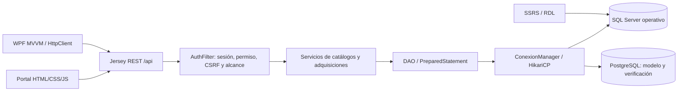

# Manual técnico

## Arquitectura

Se conservaron modelos, DAO, servicios, recursos y páginas originales de los cuatro catálogos. Se añadieron módulos sobre esquemas explícitos (`Modulo`), DAO parametrizado, servicios y recursos separados. No se aceptan nombres de tablas/columnas del cliente. Los CRUD heredados mantienen camelCase; los nuevos recursos `/gestion` usan nombres de columnas y `_key` para claves compuestas.

## Persistencia

`ConexionManager` crea pools independientes bajo demanda: máximo 5 conexiones y mínimo 1, espera de conexión 10 s, validación 3 s. `try-with-resources` devuelve cada conexión al pool. El listener cierra los pools al detener el contexto. El dashboard reutiliza una sola conexión para métricas y ranking, evitando bloqueos del pool por adquisiciones anidadas. La API operativa usa SQL Server; PostgreSQL se prueba con el mismo manager en migraciones/semilla/verificación y en diagnóstico protegido. No hay doble escritura ni transacción distribuida.

Migraciones V001/V002/V003/V004: multivaluados normalizados, estados activos, auditoría, índices, vista, compatibilidad tipo/subtipo, pares comerciales canónicos y triggers de protección temporal e histórica. `SchemaVersion` controla versiones. Las reglas de integridad ejecutadas en ambos motores rechazan precios/cantidades inválidos, oferta sin orden o fuera de período, detalles incompatibles, reasignación con ofertas, cambios de fechas que invalidan hijos y modificación de ofertas ganadoras.

Adquisiciones usa una conexión por operación, aislamiento SERIALIZABLE y bloqueos de actualización sobre órdenes/pedidos. Valida todos los detalles antes de persistir. Cabecera, detalle, asignaciones y evento de auditoría se confirman juntos o se revierten. Monto = SUM(cantidad_final × precio_acordado), DECIMAL; no se persiste un total duplicado. La fecha local de negocio no se convierte a UTC desde el navegador.

## Seguridad

BCrypt coste 12 en usuarios nuevos/semilla, contraseñas no expuestas en DTO. Sesión renovada al autenticar, cookie HttpOnly y seguimiento exclusivamente por cookie. Roles y estado se vuelven a comprobar en DB para cada solicitud; permisos por pantalla/método y denegación por defecto. Mutaciones exigen `X-CSRF-Token`. Login limita intentos por IP. AdminProveedor obtiene filtro obligatorio por su ID incluso en consultas y reportes. La autorización depende del servidor, no del menú.

Validaciones de campo/tipo/longitud, claves inmutables, cuentas protegidas, fechas, cantidades y precio. Mapper central devuelve JSON: 400 validación, 401 sin sesión, 403 denegación, 404 inexistente, 409 restricciones, 503 SQL no disponible, 500 otros errores con referencia. No envía SQL, stack traces ni credenciales. Auditoría SQL Server guarda su fecha en UTC; las fechas de pedido/oferta/resolución son DATE locales. Frontend construye DOM con textContent y eventos; las páginas anteriores se endurecieron sin eliminar funcionalidades. CSV neutraliza fórmulas al exportar.

El alcance comprobado es una demo local. No se certificaron TLS, pruebas de penetración exhaustivas, alta disponibilidad ni recuperación ante desastre. Para despliegue en red adaptar HTTPS, cookies Secure y cuentas SQL con mínimos privilegios. La sesión de API no autentica Windows ante SSRS: deben configurarse permisos separados.

## API resumida

| Ruta relativa a /api | Método | Función |
| --- | --- | --- |
| /login | POST | nombreUsuario, contrasena → usuario, permisos, csrf |
| /login/me | GET | Sesión actual |
| /login/logout | POST | Invalidar sesión (CSRF) |
| /gestion/{modulo}/schema | GET | Metadatos de formulario |
| /gestion/{modulo}?page=1&pageSize=20&q=texto | GET | Listado, total y paginación (máximo 100) |
| /gestion/{modulo}/{key} | GET/PUT/DELETE | Consulta, edición y eliminación |
| /gestion/{modulo} | POST | Alta |
| /ordenes y /ordenes/{id} | GET/POST/PUT/DELETE | Orden agrupada; pedidoIds |
| /adjudicaciones y /adjudicaciones/{id} | GET/POST/PUT/DELETE | Cabecera + detalles atómicos |
| /reportes | GET | Ocho informes y estado de configuración SSRS |
| /reportes/{1..8} | GET | articulo, proveedor, orden, sucursal, anio, desde, hasta |
| /dashboard | GET | Métricas con alcance del rol |
| /conexion/test | GET | SELECT 1 real por motor y tiempos, protegido |
| /auditoria?page=1 | GET | Eventos paginados |
| /articulos, /sucursales, /departamentos, /proveedores | CRUD | Compatibilidad con páginas originales |
| /proveedores/{id}/articulos | CRUD | Relación heredada con alcance de proveedor |

Módulos: sucursales, departamentos, articulos, proveedores, proveedorarticulos, telefonos, rubros, relaciones, tiposorden, subtiposorden, roles, pantallas, permisos, usuarios, pedidos, ofertas, evaluaciones. Claves compuestas se codifican en URL y separan con `~`; no se cambian al editar. DELETE nuevo devuelve 204; algunas rutas heredadas devuelven 200 por compatibilidad.

Una orden recibe `descripcion`, `fecha_creacion`, `fecha_limite_oferta`, `id_tipo`, `id_subtipo` opcional y `pedidoIds`. Una adjudicación recibe `id_orden`, `fecha_resolucion` y `detalles`: `id_pedido`, `id_oferta`, `cantidad_final`, `precio_acordado` por pedido. No se acepta adjudicación parcial, duplicada ni precio diferente de la oferta seleccionada.

## WPF

`ApiClient` mantiene CookieContainer y CSRF; `MainViewModel` controla módulos, consultas y tablas; `EditorViewModel` controla formularios de catálogo; `WorkflowViewModel` prepara órdenes y adjudicaciones. Las ventanas enlazan datos y muestran errores. La vista de reportes consulta la misma API y exporta CSV; SSRS se abre por URL con autorización Windows independiente. El modo `--self-test` usa estos clientes/viewmodels contra DB real y renderiza el dashboard a PNG. No equivale a una prueba manual de cada interacción de ventana.

## Consultas y rendimiento

Ocho consultas de agregación y joins parametrizadas, además de vista `vw_OrdenesAbiertas`, se entregan en `db/queries`. Catálogos y órdenes usan OFFSET/FETCH y límite 100. Las consultas de comparación cargan ofertas en bloque. Promedio de evaluación se obtiene en SQL dentro de la consulta de proveedor; no se hace una llamada HTTP por fila. Índices apoyan pedido/orden, oferta/pedido-proveedor/fecha, adjudicación/fecha y departamento/sucursal. No se midió rendimiento a escala productiva.

## Decisiones académicas

La fuente de verdad es el PDF oficial UMG Salamá BD I, páginas 1–6. Escritorio Visual Studio se cubre con WPF; Java/Jersey reutiliza el backend existente. SQL Server mantiene el papel principal; PostgreSQL no se elimina. SSRS tiene RDL propios y no se reemplaza con Jasper; Jasper no existía en la base del proyecto y la solicitud posterior lo deja como complemento condicionado, por eso NO APLICA. Inventario/ventas no forman parte del modelo oficial. El monto y el ganador se derivan de detalles/ofertas reales, sin datos simulados en dashboard.

Archivos iniciales externos (DDL, diccionario y drawio) fueron referencias para conservar nombres/relaciones; el diccionario final se extrae de metadatos de ambas bases. La auditoría inicial se conserva como fotografía histórica, no como diagnóstico actual.
