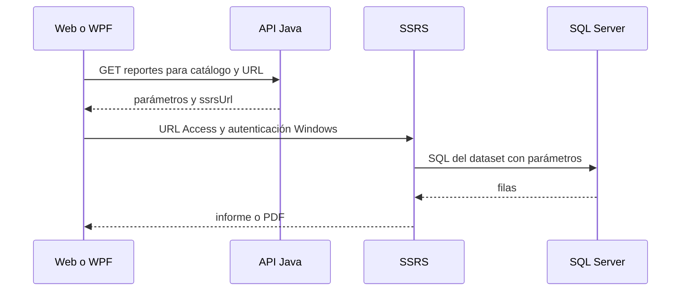

# Reportes: consultas, RDL y ocho salidas reales

Complemento de los capítulos 16–17. Jasper no está implementado: no hay JRXML/JASPER ni dependencia JasperReports. El JSON/CSV de clientes y el PDF SSRS son mecanismos diferentes. Evidencia final: [CIERRE_SSRS](CIERRE_SSRS.md), [publicación](evidencias/cierre/ssrs/publicacion-real.json), [comparación](evidencias/cierre/ssrs/verificacion-datos.json).

## Publicación y seguridad

SSRS ejecuta el dataset Datos con fuente compartida /GuateCompras/GuateComprasSQL, proveedor SQL y autenticación Windows. El script publicador crea carpeta/fuente y sube los ocho RDL con overwrite; el RDS se conserva como diseño del datasource. El publicador usa Windows PowerShell 5.1/New-WebServiceProxy/ReportService2010, no API Java. Las cuentas Windows requieren permisos SSRS y acceso SQL apropiados; no se certifica un GRANT específico que no figure en evidencia.

URL de servicio verificada: http://localhost/ReportServer. Portal: http://localhost/Reports/browse/GuateCompras. Las bases de catálogo y temporales pertenecen al servidor SSRS y no al modelo académico. No se inspeccionaron sus nombres efectivos ni su esquema mediante JDBC; no se certifican por asumir los nombres predeterminados.



Los ocho RDL usan página 11.7×8.3 pulgadas, márgenes 0.5 y tablix 10.5; tabla con encabezados continuados, texto y números. Campos monetarios del diseño tienen formato numérico dos decimales; no se imprime Q en cada celda. La semilla/API utiliza GTQ. El tamaño/paginación final depende de filas y longitud de texto.

## 1. 01_HistorialCompra

**Propósito.** Reconstruir compras adjudicadas de artículos, mostrando proveedor, fecha, cantidad, precio y monto.

**Archivo:** [`reports/ssrs/01_HistorialCompra.rdl`](../reports/ssrs/01_HistorialCompra.rdl). **Fuente:** /GuateCompras/GuateComprasSQL, base GuateComprasSQL Server. **Dataset:** Datos. **Tablas/vistas referenciadas:** Adjudicacion, Articulo, DetalleAdjudicacion, Oferta, Pedido, Proveedor.

| Parámetro RDL | Tipo | Predeterminado real |
|---|---|---|
| Articulo | Integer | `0` |
| Desde | DateTime | `=DateAdd("yyyy",-1,Today())` |
| Hasta | DateTime | `=Today()` |

**Filtros/cálculo/agrupación.** CAST(cantidad_final*precio_acordado AS DECIMAL(18,2)); sin GROUP BY. Articulo=0 admite todos, fechas inclusivas sobre resolución. El diseño no añade GroupExpressions al dataset; las agrupaciones de negocio son las de SQL, si existen.

**Consulta literal del RDL:**

```sql
SELECT ar.codigo_articulo,ar.nombre AS articulo,v.nombre_comercial AS proveedor,a.fecha_resolucion,d.cantidad_final,d.precio_acordado,CAST(d.cantidad_final*d.precio_acordado AS DECIMAL(18,2)) AS monto FROM DetalleAdjudicacion d JOIN Adjudicacion a ON a.id_adjudicacion=d.id_adjudicacion JOIN Pedido p ON p.id_pedido=d.id_pedido JOIN Articulo ar ON ar.id_articulo=p.id_articulo JOIN Oferta f ON f.id_oferta=d.id_oferta JOIN Proveedor v ON v.id_proveedor=f.id_proveedor WHERE (@Articulo=0 OR ar.id_articulo=@Articulo) AND a.fecha_resolucion BETWEEN @Desde AND @Hasta  ORDER BY ar.nombre,a.fecha_resolucion,v.nombre_comercial
```

**Consulta API:** `GET /api/reportes/1?desde=2025-01-01&hasta=2026-12-31`. Para visualizar SSRS: `http://localhost/ReportServer?/GuateCompras/01_HistorialCompra&rs:Command=Render` y completar parámetros solicitados. Para exportar todos con datos conocidos usar el comando de INSTALACION.md; las fechas del API no se transfieren por magia a una nueva pestaña sin parámetros.

**Salida verificada:** 30 filas, 2 páginas; PDF [original SSRS](evidencias/cierre/ssrs/01_HistorialCompra.pdf). Todos sus campos coinciden con baseline-consultas.json. La comparación 3 incluye tres GANADORA; el promedio 7 es 12 días. No acreditar otras fechas/filtros sin una ejecución nueva.

## 2. 02_Top Proveedores

**Propósito.** Identificar hasta cinco proveedores con mayor monto adjudicado en el rango de resoluciones.

**Archivo:** [`reports/ssrs/02_TopProveedores.rdl`](../reports/ssrs/02_TopProveedores.rdl). **Fuente:** /GuateCompras/GuateComprasSQL, base GuateComprasSQL Server. **Dataset:** Datos. **Tablas/vistas referenciadas:** Adjudicacion, DetalleAdjudicacion, Oferta, Proveedor.

| Parámetro RDL | Tipo | Predeterminado real |
|---|---|---|
| Desde | DateTime | `=DateAdd("yyyy",-1,Today())` |
| Hasta | DateTime | `=Today()` |

**Filtros/cálculo/agrupación.** SUM de cantidad×precio, COUNT(DISTINCT id_orden), GROUP BY código/nombre proveedor y TOP(5). Orden monto descendente y código para desempate. El diseño no añade GroupExpressions al dataset; las agrupaciones de negocio son las de SQL, si existen.

**Consulta literal del RDL:**

```sql
SELECT TOP(5) v.codigo_proveedor,v.nombre_comercial AS proveedor,SUM(CAST(d.cantidad_final*d.precio_acordado AS DECIMAL(18,2))) AS monto_adjudicado,COUNT(DISTINCT a.id_orden) AS ordenes FROM DetalleAdjudicacion d JOIN Adjudicacion a ON a.id_adjudicacion=d.id_adjudicacion JOIN Oferta f ON f.id_oferta=d.id_oferta JOIN Proveedor v ON v.id_proveedor=f.id_proveedor WHERE a.fecha_resolucion BETWEEN @Desde AND @Hasta  GROUP BY v.codigo_proveedor,v.nombre_comercial ORDER BY monto_adjudicado DESC,v.codigo_proveedor
```

**Consulta API:** `GET /api/reportes/2?desde=2025-01-01&hasta=2026-12-31`. Para visualizar SSRS: `http://localhost/ReportServer?/GuateCompras/02_TopProveedores&rs:Command=Render` y completar parámetros solicitados. Para exportar todos con datos conocidos usar el comando de INSTALACION.md; las fechas del API no se transfieren por magia a una nueva pestaña sin parámetros.

**Salida verificada:** 5 filas, 1 página; PDF [original SSRS](evidencias/cierre/ssrs/02_TopProveedores.pdf). Todos sus campos coinciden con baseline-consultas.json. La comparación 3 incluye tres GANADORA; el promedio 7 es 12 días. No acreditar otras fechas/filtros sin una ejecución nueva.

## 3. 03_ComparacionOfertas

**Propósito.** Comparar ofertas de los pedidos de una orden y reconocer la oferta realmente adjudicada.

**Archivo:** [`reports/ssrs/03_ComparacionOfertas.rdl`](../reports/ssrs/03_ComparacionOfertas.rdl). **Fuente:** /GuateCompras/GuateComprasSQL, base GuateComprasSQL Server. **Dataset:** Datos. **Tablas/vistas referenciadas:** Articulo, DetalleAdjudicacion, Oferta, Pedido, Proveedor.

| Parámetro RDL | Tipo | Predeterminado real |
|---|---|---|
| Orden | Integer | Sin predeterminado; obligatorio |

**Filtros/cálculo/agrupación.** LEFT JOIN DetalleAdjudicacion por id_oferta. Ganadora BIT; cantidades/preciosfinales null para no seleccionadas. Orden pedido/precio/id_oferta. No selecciona menor precio automáticamente. El diseño no añade GroupExpressions al dataset; las agrupaciones de negocio son las de SQL, si existen.

**Consulta literal del RDL:**

```sql
SELECT p.id_pedido,ar.nombre AS articulo,p.cantidad,v.nombre_comercial AS proveedor,f.precio_unitario,f.fecha_oferta,CAST(CASE WHEN d.id_oferta IS NULL THEN 0 ELSE 1 END AS BIT) AS ganadora,d.cantidad_final,d.precio_acordado FROM Oferta f JOIN Pedido p ON p.id_pedido=f.id_pedido JOIN Articulo ar ON ar.id_articulo=p.id_articulo JOIN Proveedor v ON v.id_proveedor=f.id_proveedor LEFT JOIN DetalleAdjudicacion d ON d.id_oferta=f.id_oferta WHERE p.id_orden=@Orden  ORDER BY p.id_pedido,f.precio_unitario,f.id_oferta
```

**Consulta API:** `GET /api/reportes/3?orden=10`. Para visualizar SSRS: `http://localhost/ReportServer?/GuateCompras/03_ComparacionOfertas&rs:Command=Render` y completar parámetros solicitados. Para exportar todos con datos conocidos usar el comando de INSTALACION.md; las fechas del API no se transfieren por magia a una nueva pestaña sin parámetros.

**Salida verificada:** 9 filas, 1 página; PDF [original SSRS](evidencias/cierre/ssrs/03_ComparacionOfertas.pdf). Todos sus campos coinciden con baseline-consultas.json. La comparación 3 incluye tres GANADORA; el promedio 7 es 12 días. No acreditar otras fechas/filtros sin una ejecución nueva.

## 4. 04_PedidosSinAsignar

**Propósito.** Detectar necesidades que todavía no se han agrupado en una orden.

**Archivo:** [`reports/ssrs/04_PedidosSinAsignar.rdl`](../reports/ssrs/04_PedidosSinAsignar.rdl). **Fuente:** /GuateCompras/GuateComprasSQL, base GuateComprasSQL Server. **Dataset:** Datos. **Tablas/vistas referenciadas:** Articulo, Departamento, Pedido, Sucursal.

| Parámetro RDL | Tipo | Predeterminado real |
|---|---|---|
| Ninguno | — | — |

**Filtros/cálculo/agrupación.** WHERE id_orden IS NULL; orden fecha necesaria e id_pedido. Sin agregado. El diseño no añade GroupExpressions al dataset; las agrupaciones de negocio son las de SQL, si existen.

**Consulta literal del RDL:**

```sql
SELECT p.id_pedido,s.codigo_sucursal,d.nombre AS departamento,a.nombre AS articulo,p.cantidad,p.fecha_solicitud,p.fecha_necesaria FROM Pedido p JOIN Departamento d ON d.id_departamento=p.id_departamento JOIN Sucursal s ON s.id_sucursal=d.id_sucursal JOIN Articulo a ON a.id_articulo=p.id_articulo WHERE p.id_orden IS NULL  ORDER BY p.fecha_necesaria,p.id_pedido
```

**Consulta API:** `GET /api/reportes/4`. Para visualizar SSRS: `http://localhost/ReportServer?/GuateCompras/04_PedidosSinAsignar&rs:Command=Render` y completar parámetros solicitados. Para exportar todos con datos conocidos usar el comando de INSTALACION.md; las fechas del API no se transfieren por magia a una nueva pestaña sin parámetros.

**Salida verificada:** 40 filas, 3 páginas; PDF [original SSRS](evidencias/cierre/ssrs/04_PedidosSinAsignar.pdf). Todos sus campos coinciden con baseline-consultas.json. La comparación 3 incluye tres GANADORA; el promedio 7 es 12 días. No acreditar otras fechas/filtros sin una ejecución nueva.

## 5. 05_OrdenesAbiertas

**Propósito.** Consultar la vista de órdenes actualmente habilitadas para ofertas.

**Archivo:** [`reports/ssrs/05_OrdenesAbiertas.rdl`](../reports/ssrs/05_OrdenesAbiertas.rdl). **Fuente:** /GuateCompras/GuateComprasSQL, base GuateComprasSQL Server. **Dataset:** Datos. **Tablas/vistas referenciadas:** vw_OrdenesAbiertas.

| Parámetro RDL | Tipo | Predeterminado real |
|---|---|---|
| Ninguno | — | — |

**Filtros/cálculo/agrupación.** vw_OrdenesAbiertas aplica NOT EXISTS resolución y fecha_creacion<=hoy<=fecha_limite. Orden fecha límite/id. V004 es la definición actual. El diseño no añade GroupExpressions al dataset; las agrupaciones de negocio son las de SQL, si existen.

**Consulta literal del RDL:**

```sql
SELECT o.* FROM vw_OrdenesAbiertas o WHERE 1=1  ORDER BY o.fecha_limite_oferta,o.id_orden
```

**Consulta API:** `GET /api/reportes/5`. Para visualizar SSRS: `http://localhost/ReportServer?/GuateCompras/05_OrdenesAbiertas&rs:Command=Render` y completar parámetros solicitados. Para exportar todos con datos conocidos usar el comando de INSTALACION.md; las fechas del API no se transfieren por magia a una nueva pestaña sin parámetros.

**Salida verificada:** 10 filas, 1 página; PDF [original SSRS](evidencias/cierre/ssrs/05_OrdenesAbiertas.pdf). Todos sus campos coinciden con baseline-consultas.json. La comparación 3 incluye tres GANADORA; el promedio 7 es 12 días. No acreditar otras fechas/filtros sin una ejecución nueva.

## 6. 06_Gasto Departamento

**Propósito.** Sumar lo adjudicado por sucursal y departamento en un año.

**Archivo:** [`reports/ssrs/06_GastoDepartamento.rdl`](../reports/ssrs/06_GastoDepartamento.rdl). **Fuente:** /GuateCompras/GuateComprasSQL, base GuateComprasSQL Server. **Dataset:** Datos. **Tablas/vistas referenciadas:** Adjudicacion, Departamento, DetalleAdjudicacion, Pedido, Sucursal.

| Parámetro RDL | Tipo | Predeterminado real |
|---|---|---|
| Sucursal | Integer | `0` |
| Anio | Integer | `=Year(Today())` |

**Filtros/cálculo/agrupación.** SUM cantidad×precio; GROUP BY sucursal/ciudad/departamento. Sucursal=0 admite todas; año desde enero 1 inclusive hasta enero 1 siguiente exclusivo. El diseño no añade GroupExpressions al dataset; las agrupaciones de negocio son las de SQL, si existen.

**Consulta literal del RDL:**

```sql
SELECT s.codigo_sucursal,s.ciudad,de.nombre AS departamento,SUM(CAST(d.cantidad_final*d.precio_acordado AS DECIMAL(18,2))) AS gasto FROM DetalleAdjudicacion d JOIN Adjudicacion a ON a.id_adjudicacion=d.id_adjudicacion JOIN Pedido p ON p.id_pedido=d.id_pedido JOIN Departamento de ON de.id_departamento=p.id_departamento JOIN Sucursal s ON s.id_sucursal=de.id_sucursal WHERE (@Sucursal=0 OR s.id_sucursal=@Sucursal) AND a.fecha_resolucion>=@InicioAnio AND a.fecha_resolucion<@FinAnio GROUP BY s.codigo_sucursal,s.ciudad,de.nombre ORDER BY s.codigo_sucursal,de.nombre
```

**Consulta API:** `GET /api/reportes/6?sucursal=0&anio=2026`. Para visualizar SSRS: `http://localhost/ReportServer?/GuateCompras/06_GastoDepartamento&rs:Command=Render` y completar parámetros solicitados. Para exportar todos con datos conocidos usar el comando de INSTALACION.md; las fechas del API no se transfieren por magia a una nueva pestaña sin parámetros.

**Salida verificada:** 10 filas, 1 página; PDF [original SSRS](evidencias/cierre/ssrs/06_GastoDepartamento.pdf). Todos sus campos coinciden con baseline-consultas.json. La comparación 3 incluye tres GANADORA; el promedio 7 es 12 días. No acreditar otras fechas/filtros sin una ejecución nueva.

## 7. 07_PromedioAdjudicacion

**Propósito.** Calcular cantidad de resoluciones y promedio de días entre creación de orden y resolución.

**Archivo:** [`reports/ssrs/07_PromedioAdjudicacion.rdl`](../reports/ssrs/07_PromedioAdjudicacion.rdl). **Fuente:** /GuateCompras/GuateComprasSQL, base GuateComprasSQL Server. **Dataset:** Datos. **Tablas/vistas referenciadas:** Adjudicacion, OrdenCompra.

| Parámetro RDL | Tipo | Predeterminado real |
|---|---|---|
| Desde | DateTime | `=DateAdd("yyyy",-1,Today())` |
| Hasta | DateTime | `=Today()` |

**Filtros/cálculo/agrupación.** COUNT(*) y AVG(CAST(DATEDIFF(DAY,creación,resolución) AS DECIMAL(10,2))). Desde/Hasta sobre fecha_resolucion, inclusivos. Días de calendario. El diseño no añade GroupExpressions al dataset; las agrupaciones de negocio son las de SQL, si existen.

**Consulta literal del RDL:**

```sql
SELECT COUNT(*) AS ordenes_adjudicadas,AVG(CAST(DATEDIFF(DAY,o.fecha_creacion,a.fecha_resolucion) AS DECIMAL(10,2))) AS promedio_dias FROM Adjudicacion a JOIN OrdenCompra o ON o.id_orden=a.id_orden WHERE a.fecha_resolucion BETWEEN @Desde AND @Hasta
```

**Consulta API:** `GET /api/reportes/7?desde=2025-01-01&hasta=2026-12-31`. Para visualizar SSRS: `http://localhost/ReportServer?/GuateCompras/07_PromedioAdjudicacion&rs:Command=Render` y completar parámetros solicitados. Para exportar todos con datos conocidos usar el comando de INSTALACION.md; las fechas del API no se transfieren por magia a una nueva pestaña sin parámetros.

**Salida verificada:** 1 fila, 1 página; PDF [original SSRS](evidencias/cierre/ssrs/07_PromedioAdjudicacion.pdf). Todos sus campos coinciden con baseline-consultas.json. La comparación 3 incluye tres GANADORA; el promedio 7 es 12 días. No acreditar otras fechas/filtros sin una ejecución nueva.

## 8. 08_EvolucionPrecios

**Propósito.** Consultar precios ofrecidos por artículo/proveedor a lo largo de fechas; no solo precios ganadores.

**Archivo:** [`reports/ssrs/08_EvolucionPrecios.rdl`](../reports/ssrs/08_EvolucionPrecios.rdl). **Fuente:** /GuateCompras/GuateComprasSQL, base GuateComprasSQL Server. **Dataset:** Datos. **Tablas/vistas referenciadas:** Articulo, Oferta, Pedido, Proveedor.

| Parámetro RDL | Tipo | Predeterminado real |
|---|---|---|
| Articulo | Integer | `0` |
| Proveedor | Integer | `0` |
| Desde | DateTime | `=DateAdd("yyyy",-1,Today())` |
| Hasta | DateTime | `=Today()` |

**Filtros/cálculo/agrupación.** Articulo/Proveedor=0 opcionales; fechas inclusivas sobre oferta. Orden artículo/proveedor/fecha/id_oferta. Sin agregado ni gráfica temporal. El diseño no añade GroupExpressions al dataset; las agrupaciones de negocio son las de SQL, si existen.

**Consulta literal del RDL:**

```sql
SELECT ar.codigo_articulo,ar.nombre AS articulo,v.nombre_comercial AS proveedor,f.fecha_oferta,f.precio_unitario,p.id_orden FROM Oferta f JOIN Pedido p ON p.id_pedido=f.id_pedido JOIN Articulo ar ON ar.id_articulo=p.id_articulo JOIN Proveedor v ON v.id_proveedor=f.id_proveedor WHERE (@Articulo=0 OR ar.id_articulo=@Articulo) AND (@Proveedor=0 OR f.id_proveedor=@Proveedor) AND f.fecha_oferta BETWEEN @Desde AND @Hasta  ORDER BY ar.nombre,v.nombre_comercial,f.fecha_oferta,f.id_oferta
```

**Consulta API:** `GET /api/reportes/8?desde=2025-01-01&hasta=2026-12-31`. Para visualizar SSRS: `http://localhost/ReportServer?/GuateCompras/08_EvolucionPrecios&rs:Command=Render` y completar parámetros solicitados. Para exportar todos con datos conocidos usar el comando de INSTALACION.md; las fechas del API no se transfieren por magia a una nueva pestaña sin parámetros.

**Salida verificada:** 180 filas, 10 páginas; PDF [original SSRS](evidencias/cierre/ssrs/08_EvolucionPrecios.pdf). Todos sus campos coinciden con baseline-consultas.json. La comparación 3 incluye tres GANADORA; el promedio 7 es 12 días. No acreditar otras fechas/filtros sin una ejecución nueva.

## Alcance por proveedor

ReportesServicio limita las consultas 1, 2, 3 y 8 mediante idProveedor; la consulta 5 se limita por catálogo. Prohíbe las consultas 4, 6 y 7 al proveedor. Los RDL institucionales no utilizan esa sesión Java. La interfaz omite el botón SSRS para AdminProveedor; los permisos Windows/SSRS deben administrarse por separado. Un parámetro Proveedor=0 no es una defensa de propiedad.

## Mantenimiento coherente

El SQL del API, el de los RDL y db/queries deben mantenerse alineados. Los nombres de archivo y mapeos de parámetros aparecen en portal.js y ReportWindow.xaml.cs. scripts/generar_informes.py genera diseños; esta tarea documental no lo ejecutó. Un cambio exige validar XML/XSD, publicar, exportar, comparar datos y revisar páginas. Los hashes anteriores no acreditan un archivo modificado.

