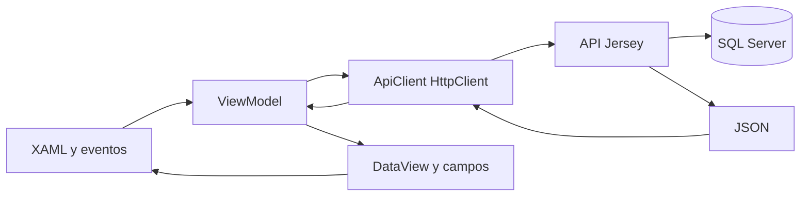

# WPF: cliente Windows, MVVM y API

Complemento del capítulo 15. [Solución](../desktop/GuateCompras.sln) y [csproj](../desktop/GuateCompras.Desktop/GuateCompras.Desktop.csproj). Target net10.0-windows, WinExe y Use WPF=true; no biblioteca MVVM externa.

| Componente | Responsabilidad |
|---|---|
| App.xaml/App.xaml.cs | Recursos, startup, vida del cliente y self-test |
| LoginWindow | URL y credenciales; ApiClient.LoginAsync |
| MainWindow/MainViewModel | Menú permitido, métricas, consultas y páginas |
| ObservableObject/AsyncCommand | Notificaciones y tareas asíncronas |
| EditorWindow/EditorViewModel | Controles, choices, cuerpo JSON y guardado |
| WorkflowWindow/WorkflowViewModel | Pedidos incluidos y líneas ganadoras |
| ReportWindow | Filtros, JSON, CSV y navegador SSRS |
| ApiClient | HttpClient, cookies, CSRF y errores |
| CsvExporter | CSV UTF-8, escape y neutralización de fórmulas |

ApiClient valida HTTP/HTTPS, normaliza BaseUrl con barra final, conserva CookieContainer y usa timeout 25 segundos. Login obtiene User con CSRF/permisos; SendAsync adjunta token en mutaciones. Una respuesta 401 borra User y un error JSON se presenta en español. No hay JDBC directo, JWT ni contraseña normal guardada en disco.

MainViewModel carga catálogo mediante gestion y rutas especiales para compras/consultas. ToTable conserva columnas numéricas como decimal para ordenar correctamente y omite estructuras anidadas/_key. EditorViewModel usa schema, carga referencias en páginas de 100 y construye cuerpo con CultureInfo.InvariantCulture. Comprueba campos/fechas/números antes de enviar; el servidor vuelve a validarlos.

WorkflowViewModel organiza PedidoChoice o AwardLine. Elegir Offer actualiza Price desde el mapa de ofertas; SaveAsync envía orden/pedidoIds o adjudicación/detalles a los recursos específicos. Las ventanas conservan handlers: es MVVM práctico con code-behind, no separación absoluta. Las reglas económicas no se reimplementan en C#.

ReportWindow consulta datos API y exporta CSV. Para SSRS crea URL con nombre RDL y parámetros y usa Process.Start con UseShellExecute: la autenticación Windows del navegador no procede de CookieContainer Java. AdminProveedor no recibe ese botón institucional.

GUATECOMPRAS_API_URL y la URL editable de login configuran el destino. build_desktop.ps1 -Isolated cambia y restaura variables del proceso para evitar el perfil NuGet inaccesible; no modifica configuración global. El EXE depende de Windows Desktop Runtime 10.

App.SelfTest ejecutó CRUD reversible, flujo de orden, consultas, formato decimal, ordenamiento, CSV y permisos reales por API. RenderTargetBitmap guardó dashboard XAML. Esa evidencia no acredita todos los clics nativos. Ver [wpf.txt](evidencias/cierre/wpf.txt) y [build](evidencias/cierre/wpf-build.txt).
