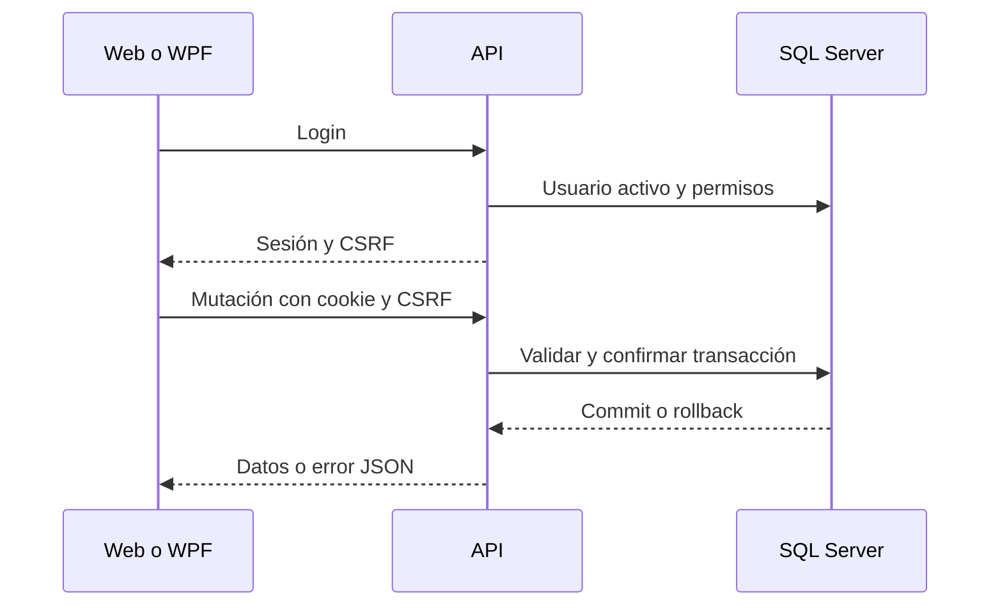

# Comunicación entre componentes

Web usa fetch; WPF HttpClient/JsonNode con CookieContainer. Login devuelve permisos/CSRF y las mutaciones envían X-CSRF-Token. SSRS usa identidad Windows independiente; el cliente no recibe credenciales JDBC.

[Volver a Arquitectura](README.md)
