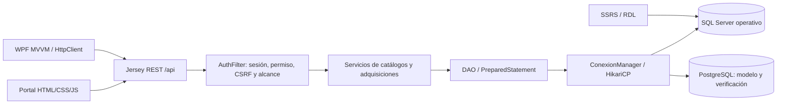

# Arquitectura general

Se conservaron modelos, DAO, servicios, recursos y páginas originales de los cuatro catálogos. Se añadieron módulos sobre esquemas explícitos (`Modulo`), DAO parametrizado, servicios y recursos separados. No se aceptan nombres de tablas/columnas del cliente. Los CRUD heredados mantienen camelCase; los nuevos recursos `/gestion` usan nombres de columnas y `_key` para claves compuestas.

[Volver a Arquitectura](README.md)
