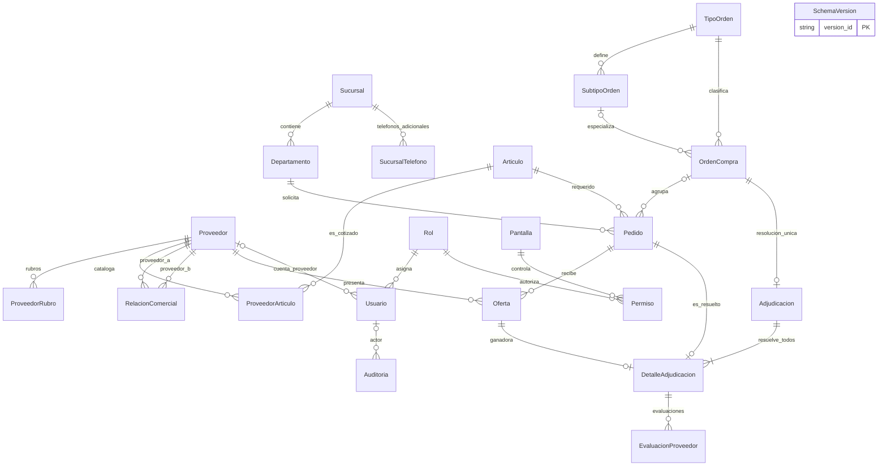

# Modelo y 3FN

## Modelo de datos, MER y tercera forma normal

Las dos bases reales contienen 22 tablas después de V001/V002/V003/V004: las 18 originales, SucursalTelefono, ProveedorRubro, Auditoria y SchemaVersion. Los diccionarios SQLSERVER/POSTGRES fueron extraídos mediante JDBC DatabaseMetaData: columnas, tipos, tamaños/precisión, nulabilidad, PK, FK e índices. Los CHECK y triggers se documentan en los DDL/migraciones; no se confunden con índices.

## MER lógico final

La cardinalidad lógica de adjudicación/detalle se refuerza por servicio y triggers: todos los pedidos de la orden, una resolución por orden y una oferta válida por pedido. Una FK por sí sola no garantiza esa regla. Los archivos MER_sqlserver.mmd y MER_postgres.mmd conservan las relaciones físicas extraídas; las FK compuestas aparecen por columna. El diagrama lógico agrupa la compatibilidad tipo/subtipo y muestra las cardinalidades finales de negocio.

## Dependencias y 3FN

- Catálogos: su ID determina atributos; códigos únicos son claves candidatas. Departamento tiene clave candidata (id_sucursal,nombre), y no repite datos de dirección/sucursal en cada departamento.
- ProveedorArticulo: (id_proveedor,id_articulo) determina precio. Cada componente referencia su catálogo; nombre y dirección del proveedor no se duplican en la relación.
- SucursalTelefono y ProveedorRubro: PK compuestas evitan listas separadas por comas y duplicados. telefono en Sucursal conserva el contacto principal del modelo previo, mientras la relación almacena teléfonos adicionales; categoria en Proveedor identifica rubro principal, mientras la relación registra pertenencias múltiples.
- Permiso: (id_rol,id_pantalla) determina cuatro autorizaciones. Nombres de rol/pantalla permanecen en sus tablas.
- Pedido: id determina departamento, artículo, cantidad, fechas y orden opcional. Estado de asignación se deriva de sus relaciones; no se duplica el proveedor ganador aquí.
- Oferta: ID determina proveedor, pedido, fecha, precio y observaciones. No copia artículo ni orden del pedido. Estado Vigente/Vencida/Adjudicada se calcula, no se mantiene en otra columna susceptible a contradicción.
- OrdenCompra: ID determina fechas, clasificación, descripción y observaciones. Estado Programada/Abierta/Vencida/Adjudicada se deriva de fecha límite y resolución.
- Adjudicacion: ID y la clave única id_orden determinan resolución/observaciones. El detalle posee su identidad y clave única (adjudicación,pedido); registra oferta, cantidad y precio como hechos de resolución.
- EvaluacionProveedor referencia el detalle; proveedor se obtiene de la oferta. Promedio y montos se calculan; no se persisten columnas redundantes de totales/rankings.
- Usuario referencia rol y proveedor; guarda hash, no contraseña. Auditoria y SchemaVersion son trazabilidad operativa separada de las entidades académicas.

Cada relación mantiene atributos atómicos y dependencias del identificador o clave completa. No se almacenan nombres de entidades referenciadas ni agregados derivados en las tablas de transacción. Los atributos de oferta y resolución conservan hechos históricos distintos de un precio vigente de catálogo.

## Integridad aplicada

V001 añade relaciones multivaluadas, estados, auditoría, índices, vista y correspondencias/fechas de ofertas y detalles. V002 añade FK compuesta tipo/subtipo, unicidad de subtipos, orden canónico de relaciones y protección ante cambios de padres/ganadores/catálogos con historial. V003 incorpora observaciones nullable de hasta 300 caracteres en orden, oferta y resolución, sin recrear tablas. Los DDL originales se conservan para instalaciones vacías; la actualización actual fue incremental.

Pruebas negativas con rollback comprobaron ambos motores; ver EVIDENCIA_VERIFICACION y final-bases.txt. SQL Server es el motor de operación del sistema; PostgreSQL replica estructura y datos de demo mediante semilla explícita, no mediante replicación automática.

[Volver a Base de datos](README.md)
