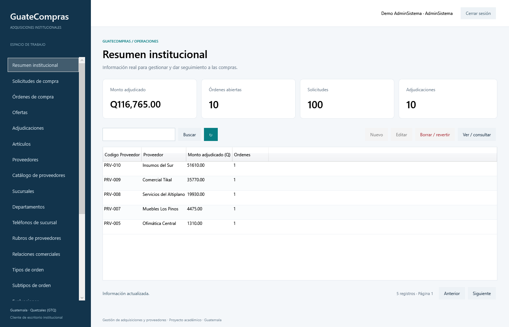

# Indicadores y lectura

La demo suma Q116765 adjudicados, 100 pedidos, 10 resoluciones, 10 órdenes abiertas, 50 artículos, 20 proveedores y 180 ofertas. Son cifras de la semilla actual, no constantes del producto. El dashboard consulta ranking e indicadores en una sola conexión y adapta el alcance al perfil.

[Volver a Dashboard](README.md)
